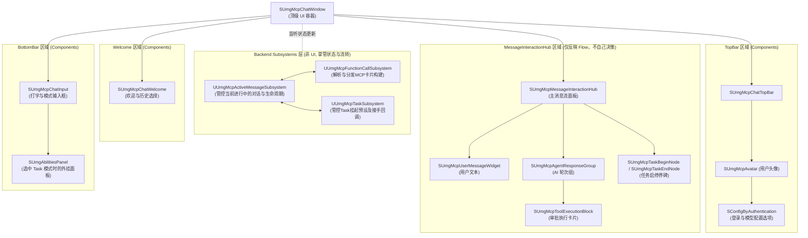
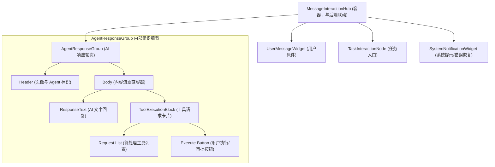

# ChatWindow 架构树（概念边界图）

## 目标
本文只描述 ChatWindow 的概念树与边界，不再把“目录名”当成概念本身。
`FabServer_SerialFlow.md` 是完整流程；本文件只负责说明哪些 UI 概念允许存在，哪些只是待审计实现细节。

## 总原则
- UI 只做布局、显示、事件转发和订阅后端回调。
- 后端 subsystem 负责业务状态、任务状态、回答归属和工具执行顺序。
- 封装不是目的；只有一个概念不可再分时才保留一个函数或一个类。
- 若某个名字不在流程文档和项目规则中形成独立概念，它就只是实现细节，不能被当作架构中心。

## 概念树

### 1. ChatWindow（窗口入口）
- 负责整体布局、显隐切换、按钮事件转发、订阅后端回调。
- 允许存在的子概念：
  - 顶部工具区
  - 中央消息显示区
  - 底部输入区
  - 会话切换 / 历史入口

### 1.1 全局架构图 (Global Architecture Boundaries)

### MessageInteractionHub 深度架构

### 2. MessageInteractionHub（消息交互枢纽）
> 这里是“消息窗口 / 总消息列表”的概念，强调与后端的联动，并且它仅仅是 `FabServer_SerialFlow` 的前端 UI 同步表面。

- 目录结构：`MessageInteractionHub/` 文件夹。
- 核心职责：完全同步后端的 `UUmgMcpActiveMessageSubsystem` 和 `UUmgMcpFunctionCallSubsystem`，**严格根据状态流转的委派刷新自身界面**。任何脱离 Flow 文档说明的 UI 内部截留逻辑都要被删除。
- 允许存在的组件级子概念（它们都从属于 MessageInteractionHub 文件夹内）：
  - **SUmgMcpMessageInteractionHub**：外层容器。
  - **SUmgMcpUserMessageWidget**：UserMessageWidget 用户消息呈现。
  - **SUmgMcpAgentResponseGroup**：AgentTurn / 活跃 Agent 消息承载组。
  - **SUmgMcpTaskBeginNode / SUmgMcpTaskEndNode**：TaskInteractionNode 任务流向卡片。
  - **SUmgMcpToolExecutionBlock**：ToolExecutionBlock 纯粹的工具请求审批队列卡片。

### 2.1 审计结论：`MessageList` 不是独立架构概念
- `MessageList` 这个词太模糊，容易把“窗口消息面”误解成“某个消息集合容器”或“某一条消息列表”。
- 不应再使用 `SUmgMcpChatList` 或者 `SUmgMcpSessionMessageSurface`，直接命名为 `SUmgMcpMessageInteractionHub`，其子组件全部放入 `MessageInteractionHub` 文件夹。

### 3. ChatMessage（单条活消息）
- 一条消息是一个活体对象，受 `StartNewChatMessage` 控制归档。
- 只有一个当前活跃对象负责监听后端状态变化。
- 历史消息归档后应只读。

### 4. TaskMessage（Task 概念）
- `task_begin` / `task_end` 是独立任务概念，不应混入普通 ChatMessage。
- 它们在 UI 上应作为单独节点出现，并由 TaskSubsystem 的委托/状态驱动。
- ChatWindow 不能自己完成 task_begin；它只能转发审批和监听后端任务节点变化。
- `FunctionCallWidgetList` 只承载普通 MCP function call；`task_begin` 必须在进入普通审批队列之前被剥离出来。

### 5. MCPApprovalSurface（MCP 审批面）
- 一组 MCP 请求按顺序呈现。
- 当前审查点可以展开详细参数。
- 审批动作只向后端发出，不由前端替代后端决策。

### 6. BackendEventBridge（后端事件桥）
- 前端只订阅后端状态变化。
- 任何状态更新都应通过委托/广播到达当前活跃消息或对应的任务/MCP UI。

## 高风险目录审计结论

### 已移除目录
- `Flow/`：已删除。
- `Learning/`：已删除。
- `Policies/`：已从 ChatWindow 目录移除，rate-limit 逻辑已迁入 AIProvider 侧。
- `MessageList/UmgMcpMessageListItemRouter`：已删除，消息面直接按概念创建和更新活跃消息承载体。

### 仍需保留审计视角的内部实现
- `UmgMcpToolMessageStateMapper`：纯状态映射工具，可以保留为内部实现，但不应提升为架构中心。

## 当前实现映射（仅作为审计对象）
## 当前实现映射（仅作为审计对象）
- `SUmgMcpChatWindow`：窗口入口。
- `SUmgMcpMessageInteractionHub`：当前承载消息面。
- `SUmgMcpAgentResponseGroup`：当前活跃 AgentResponseGroup 的 UI 承载对象。
- `SUmgMcpTaskBeginNode` / `SUmgMcpTaskEndNode`：TaskInteractionNode 的 UI 节点。
- `SUmgMcpToolExecutionBlock`：ToolExecutionBlock 审批节点。
- `SUmgMcpUserMessageWidget`：UserMessageWidget。
- `UUmgMcpTaskSubsystem`：Task 节点与队列的后台权威入口。
- `UUmgMcpActiveMessageSubsystem`：处理 Agent 对话流程、状态管理。**（已由 UUmgMcpChatSystemSubsystem 重命名并修改集成完毕）**。
- `IUmgMcpAiProvider`：rate-limit 判断与提示已迁入 provider 基类。

## 一一映射表（概念到代码）

| 概念名称 | 代码类名 | 语义说明 |
|----------|----------|----------|
| ChatWindow | SUmgMcpChatWindow | 顶级窗口容器，负责整体布局和事件转发 |
| TopBar | SUmgMcpChatTopBar | 顶栏组件，显示工具和状态 |
| Welcome | SUmgMcpChatWelcome | 欢迎页/历史列表组件 |
| ActiveMessageSubsystem | UUmgMcpActiveMessageSubsystem | 活跃对话协调器子系统 |
| BottomBar | SUmgMcpChatInput | 底部输入区，处理用户输入和模式切换 |
| UserMessageWidget | SUmgMcpUserMessageWidget | 用户消息显示组件 |
| AgentResponseGroup | SUmgMcpAgentResponseGroup | AI响应组，包含文字和MCP模块 |
| TaskInteractionNode | SUmgMcpTaskBeginNode / SUmgMcpTaskEndNode | 任务交互节点，开始和结束 |
| SystemNotificationWidget | (缺失) | 系统提示/错误恢复组件 |
| ToolExecutionBlock | SUmgMcpToolExecutionBlock | 工具执行块，MCP审批，受后端严格组装控制 |

## 必须警惕的强盗化迹象
- 名字不在规则文档中，却参与了主流程。
- 只是参数转发，却被包装成独立概念。
- 由 UI 持有了本该由后端决定的状态。
- 把一个活跃消息误写成多个消息容器。
- 把任务、MCP、消息混写成同一层概念。
- 把实现细节命名成概念中心，反过来让文档为它背书。

## 删除 / 合并原则
- 只承担中转且没有独立概念的文件，应优先合并或删除。
- 任何不属于窗口入口、消息面、单条消息、任务消息、MCP 审批面、会话保存、事件桥的内容，都应被视为架构外。
- 若一个类只是为了拆分而拆分，不承载独立概念，应优先重命名为可理解的边界名，或直接删除。
