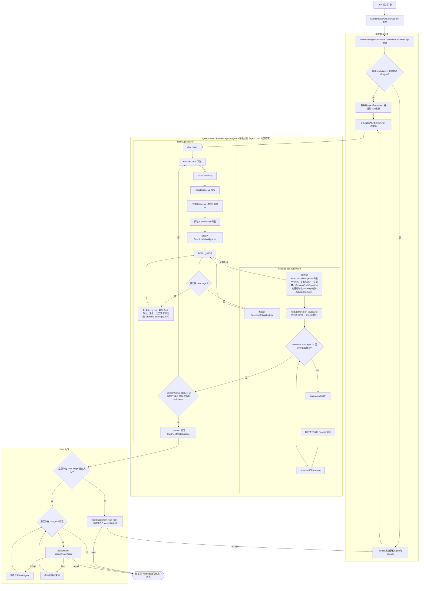

# FabServer 串联流程（小并列，大串联）

> 详细说明请分别查看：
> - [ChatMessage 生命周期（前端展示视角）](ChatMessage_Lifecycle.md)
> - [ChatWindow 理论架构图（目录与职责边界）](ChatWindow_Architecture.md)

## 概念

send:原子操作，一个网络请求，输入消息，返回消息；AI provider只提供了这个。注意：任何让AIprovider提供非send的功能的，都是强盗代码，直接删掉。
agent:对话对象，具有chat属性。
- agent自己管理对话历史信息。看到非agent的管理上下文信息直接删除即可。
- agent自己实现的chat，agent自己注册的MCP，agent自己实现的chat(send-mcp-send)循环。看到有MCP信息不是在agent里面实现的直接删掉即可
chat:对话，包含一个或多个send-mcp-send循环。chat实现的MCP逻辑，看到不是在chat里面搞的Send-MCP-send逻辑直接删掉即可。
task:任务系统，在chat end后，由task系统检查是否有task存在进而决定是否拉起其他agent继续chat
FunctionCallWidgetList:一个Functon call的队列UI。原则上后端不得直接请求MCP结果，因为权限问题。原则上所有的后端MCP请求会转变为前端FunctionCallWidgetList，由用户或者扩展的东西决定MCP是否运行。

## 状态约束

- 全局只允许一个活跃 chat in-flight。
- 前端状态以按钮语义表达：Send / Interrupt（支持 3 秒二次中断确认）。
- MCP function call 默认不同意，必须先经 UI 卡片审批后逐项串行执行；进入 UI 审批前必须先判断 FunctionCallWidgetList 是否为空。
- `task_begin/task_end` 是 task 系统委托，不进入普通 `FunctionCallWidgetList` 审批路径。

## 节点与代码对应关系

| 流程节点 | 主要代码入口 |
| --- | --- |
| User 输入消息 | `SBottomBar::OnSendClicked` (直接调用 StartNewChatMessage 定界) |
| 发送按钮切换到 Interrupt | UI 订阅 `UUmgMcpActiveMessageSubsystem::OnActiveStateChanged` 自主切换 |
| 确定对话对象（是否 @agent） | `UUmgMcpTaskSubsystem::ResolveAnswerForQuestion` |
| 获取的agent为answer，并通知Task系统 | `UUmgMcpTaskSubsystem::NotifyAgentAnswer` |
| 从Task系统获得agent为answer | `UUmgMcpTaskSubsystem::GetAgentForQuestion` |
| 更新当前活跃消息的头像、名字等 | `UUmgMcpActiveMessageSubsystem::UpdateActiveMessageMeta` |
| Provider.send 发送 | `IUmgMcpAiProvider::Send` |
| status=thinking | `UUmgMcpActiveMessageSubsystem::MarkThinking` |
| Provider.receive 接收 | `IUmgMcpAiProvider::Receive` |
| 先添加 receive 消息到消息中 | `UUmgMcpActiveMessageSubsystem::AddReceiveMessage` |
| 获取 function call 列表 | `UUmgMcpFunctionCallSubsystem::ExtractFunctionCalls` |
| 初始化 FunctionCallWidgetList | `UUmgMcpFunctionCallSubsystem::InitFunctionCallWidgetList` |
| for each function call | `UUmgMcpFunctionCallSubsystem::ProcessEachFunctionCall` |
| 是否是 task begin? | `UUmgMcpFunctionCallSubsystem::IsTaskBeginFunctionCall` |
| TaskSubsystem 委托 Task 节点 | `UUmgMcpTaskSubsystem::HandleTaskBegin` |
| 添加到 FunctionCallWidgetList | `UUmgMcpFunctionCallSubsystem::AddToFunctionCallWidgetList` |
| 所有的FunctionCallWidgetList构建一个MCP审批队列UI | `UUmgMcpFunctionCallSubsystem::BuildMcpApprovalUI` |
| UI添加到消息中（如果是空的则不添加），进入 UI 审批 | `UUmgMcpFunctionCallSubsystem::AddApprovalUIToMessage` |
| status=wait MCP | `UUmgMcpActiveMessageSubsystem::MarkWaitingMcp` |
| 用户审批当前 FunctionCall | `SUmgMcpToolMessage::OnApproveOnceClicked` |
| status=MCP running | `UUmgMcpActiveMessageSubsystem::MarkMcpRunning` |
| FunctionCallWidgetList 是否全部审批完? | `UUmgMcpFunctionCallSubsystem::IsFunctionCallWidgetListApproved` |
| FunctionCallWidgetList 是否为0? | `UUmgMcpFunctionCallSubsystem::IsFunctionCallWidgetListEmpty` |
| chat end 调用StartNewChatMessage | `UUmgMcpActiveMessageSubsystem::EndChatAndStartNew` |
| 任务入口? | `UUmgMcpTaskSubsystem::HasTaskBeginPending` |
| TaskSubsystem 完成 Task 节点并进入 accept/reject | `UUmgMcpTaskSubsystem::ProcessTaskBegin` |
| 任务结束候选 | `UUmgMcpTaskSubsystem::HasTaskEndCandidate` |
| TaskEnd UI: accept/reject/later | `TheTaskEndMessage::OnAcceptClicked` |
| 消费当前 task/agent | `UUmgMcpTaskSubsystem::ConsumeCurrentTask` |
| 移动到队列末尾 | `UUmgMcpTaskSubsystem::MoveToQueueEnd` |
| 恢复用户send按钮等待用户消息 | UI 订阅 `UUmgMcpActiveMessageSubsystem::OnActiveMessageCleared` 自主恢复 |
| 任务结束候选 | `UUmgMcpTaskSubsystem::HasTaskEndCandidate` |
| TaskEnd UI: accept/reject/later | `TheTaskEndMessage::OnAcceptClicked` |
| 消费当前 task/agent | `UUmgMcpTaskSubsystem::ConsumeCurrentTask` |
| 移动到队列末尾 | `UUmgMcpTaskSubsystem::MoveToQueueEnd` |
| 恢复用户send按钮等待用户消息 | `SUmgMcpChatWindow::ResetSendButton` |

## 守恒约束（简化原则）

- task_begin 只负责把任务入口交给 TaskSubsystem，不允许 UI 自己消化或自结束。
- task_end 只负责“释放已开始任务/弹栈回到上游 agent”。
- 系统始终遵循“先 begin 一一成立，再 end 一一释放”的守恒关系。

## Save/Resume 检查点（用于网络失败恢复）

- Checkpoint A: 发起 send 前（输入、agent、tool_mode、当前 history 快照）
- Checkpoint B: 每个 MCP 完成后（MCP 队列索引、工具结果）
- Checkpoint C: chat 结束时（response/error、task_begin pending 列表、task 栈、FunctionCallWidgetList 归档状态）
- Resume 入口：加载会话时恢复 history + task runtime，按 pending 队列继续串联流程

