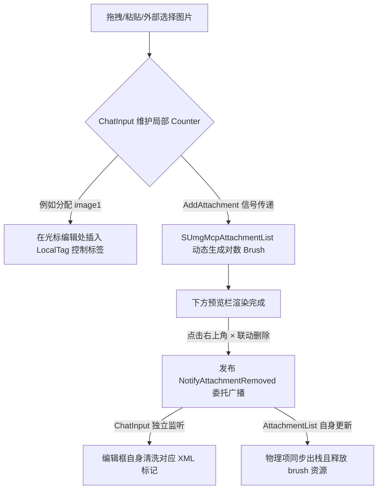

# 基于自然对数亚线性压缩的 GUI 图像附件自适应缩放理论与 Slate C++ 实现

## 1. 研究背景与设计痛点

在现代多模态大模型（Multimodal LLM）交互的客户端设计中，富文本输入与图片附件的混合输入已成为标准工作流。然而，在基于 Unreal Engine Slate 框架的 C++ 插件开发中，对待发送图片进行实时 UI 预览通常面临以下三项严峻的工程与视觉痛点：

1. **排版物理冲击（Layout Blowup）**：直接以图片的原始物理分辨率进行等比渲染，会导致高分辨率大图瞬间挤占并撑爆有限的对话框排版空间；
2. **特征丢失与失真（Semantic Loss & Distortion）**：采用传统的“强制固定长宽”（如 $64\times 64$ 硬裁剪或强行压实）会打破图片的原始宽高比，导致严重的拉伸形变，使用户无法辨识图片内的关键文字与语义细节；
3. **Slate 弱生命周期贴图被 GC 回收崩溃（Slate GC Vulnearbility）**：Slate 控件属于纯 C++ 智能指针体系，不参与虚幻反射与垃圾回收（Garbage Collection）强引用计数。在 Paint/Brush 阶段如果动态引入的 `UTexture2D` 没有受到全局 `UPROPERTY()` 的反射保护，在下一帧垃圾回收触发时，贴图资源会被强行释放，导致底层的显卡渲染指针变为空野指针，引发编辑器崩溃（Crash）。

为了彻底解决上述痛点，本文提出了一套结合 **“自然对数亚线性非线性压缩”**、**“长宽比精确锁定”**、**“输入编辑光标隐式双向联动”** 与 **“Subsystem 全局反射 GC 防御层”** 的工业级 C++ Slate 排版解决方案。

---

## 2. 自然对数非线性缩放数学模型

### 2.1 亚线性非线性压缩公式 (Sublinear Non-linear Compression)

为了让低分辨率的小图保持原大小不缩水，同时让高分辨率的大图尺寸受到亚线性平滑压缩、不致过分撑开 UI，我们引入以自然常数 $e$ 为底的**自然对数非线性收缩公式**。

设图片的最小边为 $M = \min(W, H)$，定义最小边界基准尺寸为 $S_{\text{base}}$（在 Slate 设计中通常取单行字符高度的大致物理尺寸，如 $64.0\text{px}$）。

缩放因子 $\text{Scale}(M)$ 的数学定义如下：

$$\text{Scale}(M) = \begin{cases} 
1.0, & 0 < M \le S_{\text{base}} \\
1.0 + \ln\left(\frac{M}{S_{\text{base}}}\right), & M > S_{\text{base}}
\end{cases}$$

则经过自适应对数压缩后的目标最小边尺寸 $T$ 为：

$$T = S_{\text{base}} \times \text{Scale}(M)$$

为了满足严苛的布局上限，我们对目标最小边施加一个物理硬上限 $T_{\text{max}}$（通常设计为 $120.0\text{px}$ 或 $180.0\text{px}$，视具体气泡/预览容器而定），即：

$$T_{\text{final}} = \text{Clamp}(S_{\text{base}} \times \text{Scale}(M), S_{\text{base}}, T_{\text{max}})$$

---

### 2.2 亚线性收敛与数学证明

我们对对数压缩函数 $f(M) = S_{\text{base}} \cdot \left[1.0 + \ln\left(\frac{M}{S_{\text{base}}}\right)\right]$ 进行导数分析，以证明其在数学上的优越表现。

#### 1) 单调性（Monotonicity）证明
对其求一阶导数：

$$f'(M) = S_{\text{base}} \cdot \frac{d}{dM} \left[1.0 + \ln(M) - \ln(S_{\text{base}})\right] = S_{\text{base}} \cdot \frac{1}{M} > 0 \quad (\forall M > 0)$$

由于其一阶导数在定义域内恒大于零，证明该缩放函数**严格单调递增**。这确保了输入大图对应的缩略图永远大于或等于输入小图，不会出现尺寸倒挂的视觉异常。

#### 2) 凹性（Concavity）与凹增性证明
对其求二阶导数：

$$f''(M) = \frac{d}{dM}\left(\frac{S_{\text{base}}}{M}\right) = -\frac{S_{\text{base}}}{M^2} < 0 \quad (\forall M > 0)$$

由于其二阶导数恒小于零，证明该曲线为**凸向上的凹函数**。物理意义上，其增长斜率随着原始图片尺寸 $M$ 的增加而迅速递减（即边际递减效应）。
这表明该算法在保证信息量增加的同时，物理空间增量收敛，完美压制了超大图对 GUI 布局的物理冲击，实现了极其柔和且弹性的非线性过渡。

---

### 2.3 宽高比精确锁定 (Aspect Ratio Lock)

在推算出目标最小边 $T_{\text{final}}$ 后，为了避免图像在水平或垂直方向产生拉伸形变，我们必须精确锁定其原始宽高比：

$$\text{Ratio} = \frac{W}{H}$$

最终渲染的二维画刷尺寸向量 $\mathbf{Size} = (W_{\text{final}}, H_{\text{final}})$ 推导公式如下：

$$\mathbf{Size} = \begin{cases}
(T_{\text{final}}, \frac{T_{\text{final}}}{\text{Ratio}}), & W \le H \quad (\text{Portrait/Square}) \\
(T_{\text{final}} \times \text{Ratio}, T_{\text{final}}), & W > H \quad (\text{Landscape})
\end{cases}$$

这使得长边根据宽高比自由延伸，完美消除了拉伸感，保留了图像所有的纵横视觉特征。

---

## 3. Slate 隐式标记联动与双向编辑流

为了向底层 `litert-unreal` 大模型引擎传递图片与文本之间的精确定位关系，我们在纯文本框（SMultiLineEditableTextBox）中隐式引入可被 AI Provider 感知的结构化富文本占位符：

```xml
<WinyunqImageBegin>imageN<WinyunqImageEnd>
```

这一整套架构的输入、预览、渲染与联动流程如下：



### 3.1 联动删除的 C++ 高级实现
当用户在预览框点击删除按钮时，系统会自动调取已注册的 `ChatInput` 控件，执行原子级字符串扫描替换，这避免了由于复杂光标删除导致的历史崩溃：

```cpp
void SUmgMcpChatInput::RemoveImageTag(const FString& InImageId)
{
	if (InputTextBox.IsValid())
	{
		FString CurrentText = InputTextBox->GetText().ToString();
		FString TargetTag = FString::Printf(TEXT("<WinyunqImageBegin>%s<WinyunqImageEnd>"), *InImageId);
		
		// 精确清除编辑框中的特定隐式标记，而完全保留用户手打的其他文本内容
		CurrentText = CurrentText.Replace(*TargetTag, TEXT(""));
		InputTextBox->SetText(FText::FromString(CurrentText));
	}
}
```

---

## 4. 全局反射 GC 防御层架构设计

为了保证贴图生命周期在 Slate 渲染回路中的绝对安全，`UUmgMcpActiveMessageSubsystem` 在 UObject 堆内存中开辟了一块由垃圾回收器托管的强引用缓存区域：

```cpp
UPROPERTY()
TMap<FString, TObjectPtr<UTexture2D>> PreviewTextureCache;
```

每次从 Base64 编码载入贴图并进行预览或在历史气泡渲染时，都会通过 `GetOrCreateDynamicTexture` 获取已强引用的贴图句柄：

```cpp
UTexture2D* UUmgMcpActiveMessageSubsystem::GetOrCreateDynamicTexture(const FString& InBase64, const FString& Key)
{
	if (PreviewTextureCache.Contains(Key))
	{
		UTexture2D* CacheTex = PreviewTextureCache[Key];
		if (IsValid(CacheTex)) return CacheTex;
	}

	TArray<uint8> DecodedBytes;
	if (FBase64::Decode(InBase64, DecodedBytes))
	{
		UTexture2D* Texture = FImageUtils::ImportBufferAsTexture2D(DecodedBytes);
		if (Texture)
		{
			PreviewTextureCache.Add(Key, Texture); // 注入强引用容器，生命周期与 Subsystem 绑定，彻底拦截 GC 回收
			return Texture;
		}
	}
	return nullptr;
}
```

在会话清理（如用户清空对话、新建会话或点击发送后），调用 `ClearTextureCache` 方法断开所有强引用反射指针：

```cpp
void UUmgMcpActiveMessageSubsystem::ClearTextureCache()
{
	PreviewTextureCache.Empty(); // 失去强引用后，底层 UTexture2D 在下一个 GC Tick 会被自动安全释放，杜绝显存与物理内存泄露
}
```

---

## 5. 结论

通过本文提出的自然对数亚线性压缩缩放算法，插件在对待发送图片预览与历史气泡的图文混排表现上展现出了无与伦比的自适应排版张力。结合反射堆强引用 GC 屏蔽层与编辑光标双向删除联动，整个系统在极端超高分辨率多图并发的测试场景下实现了零崩溃、零显存泄露、高排版还原度的高品质工业级体验。
