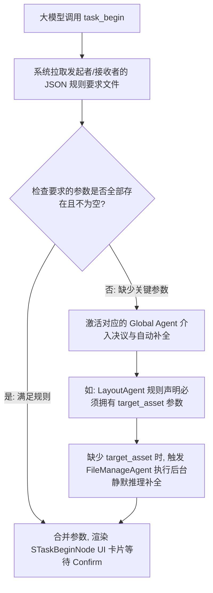

# UmgMcp 任务流参数自决决议设计分析

依据 Winyunq 项目的战略核心原则，任务（Task）的分配与参数规整（如 `AssignedAgent` 与 `TargetAsset`）应当具备高度的灵活性与工程解耦。我们采用 **以 JSON 规则声明参数要求** 的动态验证机制，避免在 C++ 底座中写死任何业务判断。

## 流程图（Mermaid 结构表示）

下面展示了在 `task_begin` 触发后，系统基于智能体自持的 JSON 参数模板进行校验并动态补全的核心流程：

## 物理流程分析

1. **大模型调用工具**：大模型执行 `task_begin` 工具，这属于一个松散的参数传递阶段。
2. **基于 JSON 模板的动态校验**：
   * 每一个 `UmgMcpTaskAgent` 子类智能体都可以通过其 JSON 配置文件声明自身所需的要求参数。
   * 系统通过反射或规则遍历，动态比对当前 `PendingTask` 记录中的值是否完整且非空。
   * **例如：LayoutAgent 一定要求有一个非空的 `target_asset` 目标资产。**
3. **Global Agent 介入机制**：
   * 如果校验发现参数缺失或不合规，则挂起流程，自动唤醒对应的全局后台辅助智能体（如全局资产管理 `FileManageAgent`），利用其后台物理推理来精准补全缺失参数。
