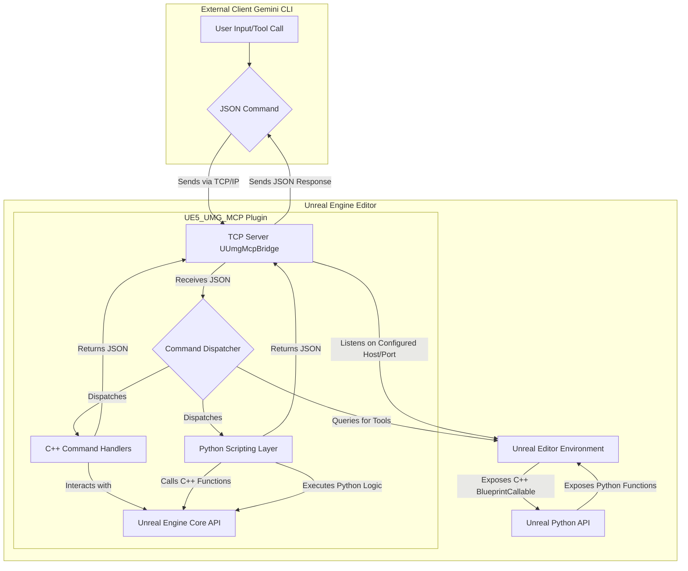

[中文版请点击此处](Readme_zh.md)

# UE5-UMG-MCP 🤖📄

**A Version-Controlled AI-Assisted UMG Workflow**


---

### 🚀 Quick Start

This section guides you through setting up and using the UMG-MCP plugin.

#### 1. Prerequisites

*   **Unreal Engine 5.5+**: Ensure you have Unreal Engine 5.5 or a newer version installed.
*   **Python 3.12+**: Python 3.12 or newer is recommended.
*   **Git**: Required for cloning the project repository.
*   **`uv` (recommended) or `pip`**: For managing Python virtual environments and dependencies.

#### 2. Plugin Installation

**Option A: Clone Repository and Install Plugin (Recommended)**

1.  **Clone the repository:**
    ```bash
    git clone https://github.com/winyunq/UnrealMotionGraphicsMCP
    cd UnrealMotionGraphicsMCP
    ```
2.  **Run the installation script:**
    This script copies the plugin to your Unreal Engine installation or project.
    Replace `[Your UE Installation Path]` with the actual path to your Unreal Engine installation (e.g., `"C:\Program Files\Epic Games\UE_5.3"`). The port number is optional and defaults to `54517`.

    ```bash
    install_to_engine.bat "[Your UE Installation Path]" [Port Number, defaults to 54517]
    ```

#### 3. Python Environment Setup

Navigate to the plugin's Python resources directory and set up a virtual environment:

```bash
cd Resources/Python
uv venv # Or use python -m venv .venv
.\.venv\Scripts\activate # Windows
# source ./.venv/bin/activate # macOS/Linux
uv pip install -e . # Or use pip install -e .
```

#### 4. Configure Gemini CLI (`settings.json`)

You need to add the MCP server tool definition to your Gemini CLI's `settings.json` file.

*   `settings.json` is typically located at `C:\Users\YourUsername\.gemini\settings.json` (Windows) or `~/.gemini/settings.json` (macOS/Linux).
*   Add the following JSON snippet to the `tools` section of your `settings.json`:

```json
"UmgMcp": {
  "command": "uv",
  "args": [
    "--directory",
    "[Plugin Path]\\Resources\\Python",
    "run",
    "UmgMcpServer.py"
  ]
}
```
*   Ensure you replace `[Plugin Path]` with the absolute path to your plugin's Python resources directory (e.g., `D:\ModelContextProtocol\unreal-engine-mcp\FlopperamUnrealMCP\Plugins\UE5_UMG_MCP`).

#### 5. Launch the MCP Server

*   First, **launch the Unreal Engine editor**.
*   In the Gemini CLI, run the following command to start the MCP server:

```python
default_api.UmgMcp()
```
*   The server will run in the background.

#### 6. Test Communication

Once the server is running, you can test communication with Unreal Engine:

```python
print(default_api.get_last_edited_umg_asset())
# Expected output example: {"status": "success", "result": {"status": "success", "asset_path": "/Game/YourAssetPath"}}
```

---

## English

This project provides a powerful, command-line driven workflow for managing Unreal Engine's UMG UI assets. By treating **human-readable `.json` files as the sole Source of Truth**, it fundamentally solves the challenge of versioning binary `.uasset` files in Git.

Inspired by tools like `blender-mcp`, this system allows developers, UI designers, and AI assistants to interact with UMG assets programmatically, enabling true Git collaboration, automated UI generation, and iteration.

### Core Philosophy: Focus & Traceability

*   **Focus**: We only care about UMG. This project aims to be the optimal solution for managing UI assets in UE, without venturing into other domains.
*   **Traceability**: All UI changes are made by modifying `.json` files. This means every adjustment to alignment, color, or layout can be clearly reviewed, merged, and reverted in Git history.

### Core Workflow

The workflow revolves around two core operations, orchestrated by a central management script (`mcp.py`):\n\n1.\t**Export (UMG -> JSON):** A UE Python script reads existing `.uasset` files in the editor and "decompiles" their widget hierarchy and properties into a structured `.json` file. This `.json` file is what you commit to Git.\n2.\t**Apply (JSON -> UMG):** A UE Python script reads the `.json` file and programmatically creates or overwrites a `.uasset` file within the editor. This is the step where your version-controlled text file is "compiled" back into an engine-usable asset.

### Current Status & Limitations

*   **Functionality**: The current version supports `export_umg_to_json` (exporting UMG to JSON) and `apply_json_to_umg` (applying JSON to UMG).
*   **Known Issues**: Please be aware that applying JSON to UMG assets might still lead to unexpected behavior or crashes due to underlying plugin limitations or specific property handling. This is an experimental tool.


### AI Authorship & Disclaimer

This project has been developed with significant assistance from **Gemini, an AI**. As such:\n*   **Experimental Nature**: This is an experimental project. Its reliability is not guaranteed.
*   **Commercial Use**: Commercial use is not recommended without thorough independent validation and understanding of its limitations.
*   **Disclaimer**: Use at your own risk. The developers and AI are not responsible for any consequences arising from its use.

---

### Current Technical Architecture Overview

The system now primarily relies on the `UE5_UMG_MCP` plugin for communication between external clients (like this CLI) and the Unreal Engine Editor.

**Architecture Diagram:**




## API Status

| Category | API Name | Status |
|---|---|:---:|
| **Context & Attention** | `get_target_umg_asset` | ✅ |
| | `set_target_umg_asset` | ✅ |
| | `get_last_edited_umg_asset` | ✅ |
| | `get_recently_edited_umg_assets` | ✅ |
| **Sensing & Querying** | `get_widget_tree` | ✅ |
| | `query_widget_properties` | ✅ |
| | `get_creatable_widget_types` | ❌ |
| | `get_widget_schema` | ❌ |
| | `get_layout_data` | ❌ |
| | `check_widget_overlap` | ❌ |
| **Actions & Modifications** | `create_widget` | ❌ |
| | `delete_widget` | ❌ |
| | `set_widget_properties` | ❌ |
| | `reparent_widget` | ❌ |
| **File Transformation** | `export_umg_to_json` | ✅ |
| | `apply_json_to_umg` | ✅ |