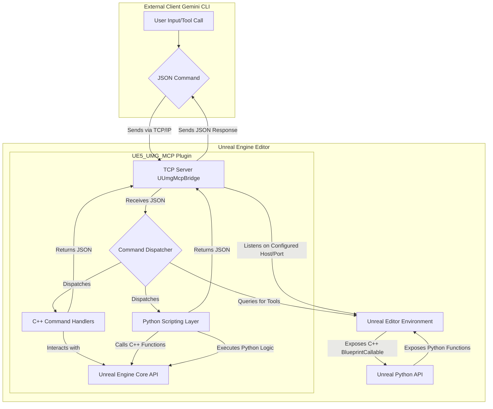

[中文版请点击此处](Readme_zh.md)

# UE5-UMG-MCP 🤖📄

**A Version-Controlled AI-Assisted UMG Workflow**


[Demo Designed A RTS UI](https://youtu.be/O86VCzxyF5o)
[Demo Recreating the UE5 editor](https://youtu.be/h_J70I0m4Ls)
[Demo Recreating the UE5 editor in UMG editor](https://youtu.be/pq12x2MH1L4)
---

### 🚀 Quick Start

This guide covers the two-step process to install the `UmgMcp` plugin and connect it to your Gemini CLI.

*   **Prerequisite:** Unreal Engine 5.6 or newer.

#### 1. Install the Plugin

1.  **Navigate to your project's Plugins folder:** `YourProject/Plugins/` (create it if it doesn't exist).
2.  **Clone the repository** directly into this directory:

    ```bash
    git clone https://github.com/winyunq/UnrealMotionGraphicsMCP.git UmgMcp
    ```

3.  **Restart the Unreal Editor.** This allows the engine to detect and compile the new plugin.

#### 2. Connect the Gemini CLI

Tell Gemini how to find and launch the MCP server.

1.  **Edit your `settings.json`** file (usually located at `C:\Users\YourUsername\.gemini\`).
2.  **Add the tool definition** to the `mcpServers` object.

    ```json
    "mcpServers": {
      "UmgMcp": {
        "command": "uv",
        "args": [
          "run",
          "--directory",
          "D:\\Path\\To\\YourUnrealProject\\Plugins\\UmgMcp\\Resources\\Python",
          "UmgMcpServer.py"
        ]
      },
      "UmgSequencer": {
        "command": "uv",
        "args": [
          "run",
          "--directory",
          "D:\\Path\\To\\YourUnrealProject\\Plugins\\UmgMcp\\Resources\\Python",
          "UmgSequencerServer.py"
        ]
      }
    }
    ```

    **IMPORTANT:** You **must** replace the path with the correct **absolute path** to the `Resources/Python` folder from the cloned repository on your machine.

That's it! When you start the Gemini CLI, it will automatically launch the MCP server in the background.

#### Testing the Connection

After restarting your Gemini CLI and opening your Unreal project, you can test the connection by calling any tool function:

```python
print(default_api.get_target_umg_asset())
```

#### Python Environment (Optional)

The plugin's Python environment is managed by `uv`. In most cases, it should work automatically. If you encounter issues related to Python dependencies (e.g., `uv` command not found or module import errors), you can manually set up the environment:

1.  Navigate to the directory: `cd YourUnrealProject/Plugins/UmgMcp/Resources/Python`
2.  Run the setup:
    ```bash
    uv venv
    .\.venv\Scripts\activate
    uv pip install -e .
    ```

---

## English

This project provides a powerful, command-line driven workflow for managing Unreal Engine's UMG UI assets. By treating **human-readable `.json` files as the sole Source of Truth**, it fundamentally solves the challenge of versioning binary `.uasset` files in Git.

Inspired by tools like `blender-mcp`, this system allows developers, UI designers, and AI assistants to interact with UMG assets programmatically, enabling true Git collaboration, automated UI generation, and iteration.

### Core Philosophy: Focus & Traceability

### AI Authorship & Disclaimer

This project has been developed with significant assistance from **Gemini, an AI**. As such:
*   **Experimental Nature**: This is an experimental project. Its reliability is not guaranteed.
*   **Commercial Use**: Commercial use is not recommended without thorough independent validation and understanding of its limitations.
*   **Disclaimer**: Use at your own risk. The developers and AI are not responsible for any consequences arising from its use.

---

### Current Technical Architecture Overview

The system now primarily relies on the `UE5_UMG_MCP` plugin for communication between external clients (like this CLI) and the Unreal Engine Editor.

**Architecture Diagram:**



## API Status

| Category | API Name | Status |
|---|---|:---:|
| **Context & Attention** | `get_target_umg_asset` | ✅ |
| | `set_target_umg_asset` | ✅ |
| | `get_last_edited_umg_asset` | ✅ |
| | `get_recently_edited_umg_assets` | ✅ |
| **Sensing & Querying** | `get_widget_tree` | ✅ |
| | `query_widget_properties` | ✅ |
| | `get_creatable_widget_types` | ✅ |
| | `get_widget_schema` | ✅ |
| | `get_layout_data` | ✅ |
| | `check_widget_overlap` | ✅ |
| **Actions & Modifications** | `create_widget` | ✅ |
| | `delete_widget` | ✅ |
| | `set_widget_properties` | ✅ |
| | `reparent_widget` | ✅ |
| | `save_asset` | ✅ |
| **File Transformation** | `export_umg_to_json` | ✅ |
| | `apply_json_to_umg` | ✅ |
| | `apply_layout` | ✅ |

## UMG Sequencer API Status

| Command | Status | Description |
| :--- | :--- | :--- |
| `set_animation_scope` | ✅ Implemented | Set the target animation for subsequent commands |
| `set_widget_scope` | ✅ Implemented | Set the target widget for subsequent commands |
| `get_all_animations` | ✅ Implemented | Get list of all animations in the blueprint |
| `create_animation` | ✅ Implemented | Create a new animation |
| `delete_animation` | ✅ Implemented | Delete an animation |
| `set_property_keys` | ✅ Implemented | Set keyframes for a property (Float only currently) |
| `remove_property_track` | 🚧 Planned | Remove a property track |
| `remove_keys` | 🚧 Planned | Remove specific keys |
| `get_animation_keyframes` | 🚧 Planned | Get keyframes for an animation |
| `get_animated_widgets` | 🚧 Planned | Get list of widgets affected by an animation |
