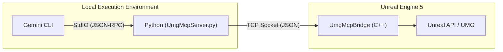

[中文版请点击此处](Readme_zh.md)

# UE5-UMG-MCP 🤖📄

**A Version-Controlled AI-Assisted UMG Workflow**


[Demo Designed A RTS UI](https://youtu.be/O86VCzxyF5o)

[Demo Recreating the UE5 editor](https://youtu.be/h_J70I0m4Ls)

[Demo Recreating the UE5 editor in UMG editor](https://youtu.be/pq12x2MH1L4)

[Chat with Gemini 3 to editor the UMG file](https://youtu.be/93_Fiil9nd8)

---

### 🚀 Quick Start

This guide covers the two-step process to install the `UmgMcp` plugin and connect it to your Gemini CLI.

*   **Prerequisite:** Unreal Engine 5.6 or newer.

#### 1. Install the Plugin

1.  **Navigate to your project's Plugins folder:** `YourProject/Plugins/` (create it if it doesn't exist).
2.  **Clone the repository** directly into this directory:

    ```bash
    git clone https://github.com/winyunq/UnrealMotionGraphicsMCP.git UmgMcp
    ```

3.  **Restart the Unreal Editor.** This allows the engine to detect and compile the new plugin.

#### 2. Connect the Gemini CLI

Tell Gemini how to find and launch the MCP server.

1.  **Edit your `settings.json`** file (usually located at `C:\Users\YourUsername\.gemini\`).
2.  **Add the tool definition** to the `mcpServers` object.

    ```json
    "mcpServers": {
      "UmgMcp": {
        "command": "uv",
        "args": [
          "run",
          "--directory",
          "D:\\Path\\To\\YourUnrealProject\\Plugins\\UmgMcp\\Resources\\Python",
          "UmgMcpServer.py"
        ]
      }
    }
    ```

    **IMPORTANT:** You **must** replace the path with the correct **absolute path** to the `Resources/Python` folder from the cloned repository on your machine.

That's it! When you start the Gemini CLI, it will automatically launch the MCP server in the background.

#### Testing the Connection

After restarting your Gemini CLI and opening your Unreal project, you can test the connection by calling any tool function:

```python
  cd Resources/Python/APITest
  python UE5_Editor_Imitation.py
```

#### Python Environment (Optional)

The plugin's Python environment is managed by `uv`. In most cases, it should work automatically. If you encounter issues related to Python dependencies (e.g., `uv` command not found or module import errors), you can manually set up the environment:

1.  Navigate to the directory: `cd YourUnrealProject/Plugins/UmgMcp/Resources/Python`
2.  Run the setup:
    ```bash
    uv venv
    .\.venv\Scripts\activate
    uv pip install -e .
    ```

---

### 🧪 Experimental: Gemini CLI Skill Support

We are experimenting with the **Gemini CLI Skill** system as an alternative to the standard MCP approach. 
The Skill architecture allows the Python tools to be loaded directly by the CLI runtime, potentially **optimizing context usage** by dynamically enabling/disabling tools via `prompts.json` and avoiding the overhead of managing a separate MCP server process.

> **Note**: The MCP server (configured above) is still the stable and recommended way to use this plugin. Use Skill mode if you want to test the latest integration capabilities.

#### Configuration (Skill Mode)

To enable Skill mode, add the following to your `settings.json` (replacing `<YOUR_PROJECT_PATH>`):

```json
  "skills": {
    "unreal_umg": {
      "path": "<YOUR_PROJECT_PATH>/Plugins/UmgMcp/Resources/Python/UmgMcpSkills.py",
      "type": "local",
      "description": "Direct control of Unreal Engine UMG via Python Skills. Auto-loads tools from prompts.json."
    }
  },
```

---

## English

This project provides a powerful, command-line driven workflow for managing Unreal Engine's UMG UI assets. By treating **human-readable `.json` files as the sole Source of Truth**, it fundamentally solves the challenge of versioning binary `.uasset` files in Git.

Inspired by tools like `blender-mcp`, this system allows developers, UI designers, and AI assistants to interact with UMG assets programmatically, enabling true Git collaboration, automated UI generation, and iteration.

---

## Prompt Manager

A visual web tool for configuring system instructions, tool descriptions, and user prompt templates.

### Features

1.  **System Instruction Editor**: Modify the global instructions for the AI context.
2.  **Tool Management**:
    *   **Enable/Disable**: Toggle specific MCP tools on or off. Disabled tools are not registered with the MCP server, effectively **compressing the context window** to prevent AI distraction.
    *   **Edit Descriptions**: Customize tool descriptions (prompts) to better suit your workflow.
3.  **User Templates (Prompts)**: Add reusable prompt templates for quick access by the MCP client.

### How to Run

Execute the following command in your Python environment:
```bash
python Resources/Python/PromptManager/server.py
```
The browser will automatically open `http://localhost:8085`.

### Usage Tips

Prompts are crucial for AI tool effectiveness. Use the Prompt Manager to tailor the AI's behavior:

*   **One-Click Deployment Mode**: If you want the AI to focus solely on generating UI from design, disable all tools except `apply_layout` and `export_umg_to_json`.
*   **Tutor Mode**: If you want the AI to guide you without making changes, keep only read-only tools (e.g., `get_widget_tree`, `get_widget_schema`).
*   **Context Optimization**: For models with smaller context windows, disable tools you aren't currently using to improve speed and accuracy.

Contributions of effective prompt configurations are welcome!

---

### AI Authorship & Disclaimer

This project has been developed with significant assistance from **Gemini, an AI**. As such:
*   **Experimental Nature**: This is an experimental project. Its reliability is not guaranteed.
*   **Commercial Use**: Commercial use is not recommended without thorough independent validation and understanding of its limitations.
*   **Disclaimer**: Use at your own risk. The developers and AI are not responsible for any consequences arising from its use.

---

### Current Technical Architecture Overview

The system now primarily relies on the `UE5_UMG_MCP` plugin for communication between external clients (like this CLI) and the Unreal Engine Editor.

**Architecture Diagram:**



## API Status

| Category | API Name | Status |
|---|---|:---:|
| **Context & Attention** | `get_target_umg_asset` | ✅ |
| | `set_target_umg_asset` | ✅ |
| | `get_last_edited_umg_asset` | ✅ |
| | `get_recently_edited_umg_assets` | ✅ |
| **Sensing & Querying** | `get_widget_tree` | ✅ |
| | `query_widget_properties` | ✅ |
| | `get_creatable_widget_types` | ✅ |
| | `get_widget_schema` | ✅ |
| | `get_layout_data` | ✅ |
| | `check_widget_overlap` | ✅ |
| **Actions & Modifications** | `create_widget` | ✅ |
| | `delete_widget` | ✅ |
| | `set_widget_properties` | ✅ |
| | `reparent_widget` | ✅ |
| | `save_asset` | ✅ |
| **File Transformation** | `export_umg_to_json` | ✅ |
| | `apply_json_to_umg` | ✅ |
| | `apply_layout` | ✅ |
 
 ## UMG Blueprint API Status (New)
 
 | Category | API Name | Status | Description |
 |---|---|:---:|---|
 | **Context & Attention** | `set_edit_function` | ✅ | Set the current edit context (Function/Event). Supports auto-creating Custom Events. |
 | | `set_cursor_node` | ✅ | Explicitly set the "Cursor" node (Program Counter). |
 | **Sensing & Querying** | `get_function_nodes` | ✅ | Get nodes in **Current Context Scope** (Filtered to connected graph to avoid global noise). |
 | | `get_variables` | ✅ | Get list of member variables. |
 | | `search_function_library` | ✅ | Search callable libraries (C++/BP). Supports Fuzzy Search. |
 | **Actions & Modifications** | `add_step(name)` | ✅ | **Core**: Add executable node by Name (e.g. "PrintString"). Auto-Wiring & Auto-Layout supported. |
 | | `prepare_value(name)` | ✅ | Add Data Node by Name (e.g. "MakeLiteralString", "GetVariable"). |
 | | `connect_data_to_pin` | ✅ | Connect pins precisely (Supports `NodeID:PinName` format). |
 | | `add_variable` | ✅ | Add new member variable. |
 | | `delete_variable` | ✅ | Delete member variable. |
 | | `delete_node` | ✅ | Delete specific node. |
 | | `compile_blueprint` | ✅ | Compile and apply changes. |

## UMG Sequencer API Status

| Command | Status | Description |
| :--- | :--- | :--- |
| `set_animation_scope` | ✅ Implemented | Set the target animation for subsequent commands |
| `set_widget_scope` | ✅ Implemented | Set the target widget for subsequent commands |
| `get_all_animations` | ✅ Implemented | Get list of all animations in the blueprint |
| `create_animation` | ✅ Implemented | Create a new animation |
| `delete_animation` | ✅ Implemented | Delete an animation |
| `set_property_keys` | ✅ Implemented | Set keyframes for a property (Float only currently) |
| `remove_property_track` | 🚧 Planned | Remove a property track |
| `remove_keys` | 🚧 Planned | Remove specific keys |
| `get_animation_keyframes` | 🚧 Planned | Get keyframes for an animation |

## Troubleshooting & Known Issues

> [!WARNING]
> **Startup Order is Critical**
> We have observed that the TCP connection handshake can be confusing. **You MUST launch the Unreal Engine 5 project FIRST**, wait for it to initialize, and **THEN launch the Gemini CLI**.
>
> If you launch the CLI first, the Python server may fail to connect correctly or enter a retry loop that results in connection failures or "success-on-kill" behavior. The UE5 Server acts as the Listener; it must be ready before the Client connects.
