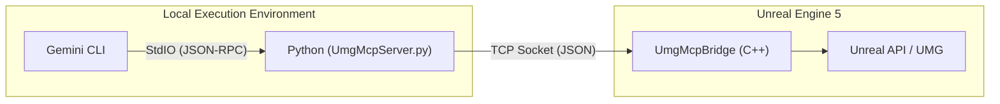

[中文版](Readme_zh.md)

<div align="center">
  <h1>UnrealMotionGraphicsMCP</h1>
  <p><strong>Open-source MCP tools for AI-assisted Unreal Engine UMG authoring.</strong></p>
  <p>
    <a href="https://winyunq.github.io/UnrealMotionGraphicsMCP/">Web Manual</a>
    · <a href="#quick-start">Quick Start</a>
    · <a href="#protocol-reference">Protocol Reference</a>
    · <a href="https://github.com/winyunq/UnrealMotionGraphicsMCP/issues">Issues</a>
    · <a href="https://discord.gg/yk5VEQ5S9U">Discord</a>
  </p>
  <p>
    
    
    
    <a href="https://agentseal.org/mcp/https-githubcom-winyunq-unrealmotiongraphicsmcp"></a>
  </p>
</div>

---

**UnrealMotionGraphicsMCP** makes Unreal UMG editing accessible to AI agents through explicit, versionable MCP commands. Instead of asking an agent to guess from screenshots or click through the editor, this plugin exposes the real editor state: widget trees, slot properties, Blueprint graph operations, UI materials, animation tracks, and JSON round-trips.

The open-source plugin is the protocol and editor bridge. It is meant to be readable, debuggable, and useful for research, custom pipelines, issue reports, and community fixes.

## What This Project Does

| Area | Open-source capability |
| --- | --- |
| UMG widgets | Create widgets, inspect trees, set properties and slots, reorder children, replace subtrees, export and apply JSON |
| Blueprint / BlueCode | Create graph nodes, wire pins, bind widget references, and apply compact code-like graph statements |
| Materials | Create UI materials, set parameters, add supported expressions, and test HLSL-oriented material workflows |
| Animation | Create UMG animation tracks and keyframes for render transform, opacity, color, and timing |
| Editor bridge | Let external MCP clients call Unreal Editor through a local loopback bridge on `127.0.0.1:55557` |

## Why It Exists

AI-assisted UI work needs more than screenshots. UMG assets are structured editor objects, and serious automation needs structured access. This project gives agents a protocol surface they can inspect, test, and improve without hiding behavior behind a black-box UI.

The core design goals are:

- **Observable edits**: Every meaningful UI change should be expressible as a tool call and reviewable as data.
- **Versionable workflows**: UMG can be exported, patched, and reapplied as structured JSON.
- **Editor-native behavior**: Commands operate through Unreal editor systems instead of browser-style click automation.
- **Open protocol first**: The repository keeps the protocol, schemas, tests, and bug fixes public.

## Quick Start

Current target: **Unreal Engine 5.8 on Win64**. The plugin descriptor is set to `EngineVersion: 5.8.0`.

### 1. Install The Plugin

Clone the open-source plugin into your Unreal project:

```powershell
cd D:\UE5Project\YourProject
mkdir Plugins
cd Plugins
git clone https://github.com/winyunq/UnrealMotionGraphicsMCP.git UmgMcp
```

Open the project in Unreal Engine 5.8, enable `UmgMcp` if needed, and restart the editor so Unreal Build Tool can compile the plugin.

### 2. Connect An MCP Client

Start Unreal Editor first. The plugin listens locally on `127.0.0.1:55557`; the Python MCP server forwards tool calls from your MCP client to that editor bridge.

Add this to your MCP client configuration, replacing the path with the absolute path to your project:

```json
{
  "mcpServers": {
    "UmgMcp": {
      "command": "uv",
      "args": [
        "run",
        "--directory",
        "D:\\UE5Project\\YourProject\\Plugins\\UmgMcp\\Resources\\Python",
        "UmgMcpServer.py"
      ]
    }
  }
}
```

Important details:

- The `--directory` value must point to `Resources/Python`.
- Windows JSON paths need escaped backslashes, for example `D:\\UE5Project\\...`.
- Keep Unreal Editor open while using the MCP client.

### 3. Verify The Setup

Run protocol checks without opening a large test scenario:

```powershell
cd D:\UE5Project\YourProject\Plugins\UmgMcp\Resources\Python
uv run python APITest\Umg_Widget_Protocol_Static_Check.py
uv run python APITest\Blueprint_MCP_Schema_Check.py
uv run python APITest\Material_Protocol_Static_Check.py
uv run python APITest\Animation_Protocol_Static_Check.py
```

Run an editor bridge smoke test after Unreal Editor is open:

```powershell
uv run python APITest\UE5_Editor_Imitation.py
```

If you want a manual virtual environment:

```powershell
cd D:\UE5Project\YourProject\Plugins\UmgMcp\Resources\Python
uv venv
.\.venv\Scripts\activate
uv pip install "mcp[cli]>=1.4.1" fastmcp uvicorn fastapi "pydantic>=2.6.1" requests
python -c "import mcp, fastapi, pydantic, requests; print('deps ok')"
```

## Documentation

The documentation site is the best place for guided setup and usage:

- [Web Manual](https://winyunq.github.io/UnrealMotionGraphicsMCP/)
- [Chinese Web Manual](https://winyunq.github.io/UnrealMotionGraphicsMCP/Document/index_zh.html)

The repository keeps protocol references close to the code:

| Topic | File |
| --- | --- |
| Widget commands and JSON round-trip | [Document/UmgWidgetMcpProtocol.md](Document/UmgWidgetMcpProtocol.md) |
| Blueprint / BlueCode graph operations | [Document/BlueprintBluecodeProtocol.md](Document/BlueprintBluecodeProtocol.md) |
| Material and HLSL-oriented operations | [Document/MaterialMcpProtocol.md](Document/MaterialMcpProtocol.md) |
| Animation / Sequencer operations | [Document/AnimationMcpProtocol.md](Document/AnimationMcpProtocol.md) |

## Example Agent Request

```text
Create /Game/UI/WBP_LoginPanel with a centered login card, email and password fields,
a primary submit button, and a subtle material background. Export the final widget JSON
and summarize which MCP tools changed the asset.
```

## Demos

- [Designing an RTS UI](https://youtu.be/O86VCzxyF5o)
- [Recreating the UE5 editor](https://youtu.be/h_J70I0m4Ls)
- [Editing UMG inside the UMG editor](https://youtu.be/pq12x2MH1L4)
- [Chatting with Gemini to edit a UMG file](https://youtu.be/93_Fiil9nd8)

## Troubleshooting

| Symptom | Fix |
| --- | --- |
| `ConnectionRefusedError`, `WinError 10061`, or `WinError 1225` | Open Unreal Editor first, enable `UmgMcp`, restart the editor, then reconnect the MCP client. |
| `uv` is not recognized | Install `uv`, restart the terminal, or create the manual virtual environment shown above. |
| Plugin does not compile | Confirm the project is UE 5.8 Win64, remove stale generated build output for this plugin/project, and let Unreal rebuild. |
| The wrong widget was edited | Set the active UMG target first or pass a full asset path such as `/Game/UI/WBP_LoginPanel.WBP_LoginPanel`. |

## Open Source And Fab

This repository is the open-source home of the UMG MCP protocol and editor bridge. The Fab package is an optional packaged distribution for users who prefer marketplace installation and production-focused packaging. Core protocol fixes should remain visible here so issues can be reported, reviewed, and reproduced in public.

Fab listing: [UMG MCP on Fab Marketplace](https://www.fab.com/zh-cn/listings/f70dbcb0-11e4-46bf-b3f7-9f30ba2c9b71)

## Contributing

Good contributions include reproducible bug reports, focused protocol tests, payload examples, documentation fixes, and small editor-side fixes with clear before/after behavior. Please include your Unreal Engine version, plugin commit, target asset path, and the MCP payload that failed when reporting an issue.

## License

This repository is released under the [MIT License](LICENSE).

---

## Full Tool Surface And Legacy Manual

The sections below are intentionally preserved from the previous README instead of being collapsed into a short landing page. They document experimental skill loading, prompt management, architecture notes, API status tables, compatibility tools, and the developer program.

<details>
<summary>🧪 Experimental: Gemini CLI Skill Support</summary>

We are experimenting with the **Gemini CLI Skill** system as an alternative to the standard MCP approach.
The Skill architecture allows the Python tools to be loaded directly by the CLI runtime, potentially **optimizing context usage** by dynamically enabling/disabling tools via `prompts.json` and avoiding the overhead of managing a separate MCP server process.

> **Note**: The MCP server (configured above) is still the stable and recommended way to use this plugin. Use Skill mode if you want to test the latest integration capabilities.

#### Configuration (Skill Mode)

To enable Skill mode, add the following to your `settings.json` (replacing `<YOUR_PROJECT_PATH>`):

```json
  "skills": {
    "unreal_umg": {
      "path": "<YOUR_PROJECT_PATH>/Plugins/UmgMcp/Resources/Python/UmgMcpSkills.py",
      "type": "local",
      "description": "Direct control of Unreal Engine UMG via Python Skills. Auto-loads tools from prompts.json."
    }
  },
```

</details>

---

This project provides a powerful, command-line driven workflow for managing Unreal Engine's UMG UI assets. By treating **human-readable `.json` files as the sole Source of Truth**, it fundamentally solves the challenge of versioning binary `.uasset` files in Git.

Inspired by tools like `blender-mcp`, this system allows developers, UI designers, and AI assistants to interact with UMG assets programmatically, enabling true Git collaboration, automated UI generation, and iteration.

---

<details>
<summary>📋 Prompt Manager</summary>

A visual web tool for configuring system instructions, tool descriptions, and user prompt templates.

### Features

1.  **System Instruction Editor**: Modify the global instructions for the AI context.
2.  **Tool Management**:
    *   **Enable/Disable**: Toggle specific MCP tools on or off. Disabled tools are not registered with the MCP server, effectively **compressing the context window** to prevent AI distraction.
    *   **Edit Descriptions**: Customize tool descriptions (prompts) to better suit your workflow.
3.  **User Templates (Prompts)**: Add reusable prompt templates for quick access by the MCP client.

### How to Run

Execute the following command in your Python environment:
```bash
python Resources/Python/PromptManager/server.py
```
The browser will automatically open `http://localhost:8085`.

### Usage Tips

Prompts are crucial for AI tool effectiveness. Use the Prompt Manager to tailor the AI's behavior:

*   **One-Click Deployment Mode**: If you want the AI to focus solely on generating UI from design, disable all tools except `apply_layout` and `export_umg_to_json`.
*   **Tutor Mode**: If you want the AI to guide you without making changes, keep only read-only tools (e.g., `get_widget_tree`, `get_widget_schema`).
*   **Context Optimization**: For models with smaller context windows, disable tools you aren't currently using to improve speed and accuracy.

Contributions of effective prompt configurations are welcome!

</details>

---

<details>
<summary>🏗️ Current Technical Architecture</summary>

The system now primarily relies on the `UE5_UMG_MCP` plugin for communication between external clients (like this CLI) and the Unreal Engine Editor.

**Architecture Diagram:**


```mermaid
flowchart LR
    subgraph "Local Execution Environment"
        CLI["Gemini CLI"] --"StdIO (JSON-RPC)"--> PY["Python (UmgMcpServer.py)"]
    end

    subgraph "Unreal Engine 5"
        PY --"TCP Socket (JSON)"--> TCP["UmgMcpBridge (C++)"]
        TCP --> API["Unreal API / UMG"]
    end
```

</details>

---

<details>
<summary>⚖️ AI Authorship &amp; Disclaimer</summary>

This project has been developed with significant assistance from **Gemini, an AI**. As such:
*   **Experimental Nature**: This is an experimental project. Its reliability is not guaranteed.
*   **Commercial Use**: Commercial use is not recommended without thorough independent validation and understanding of its limitations.
*   **Disclaimer**: Use at your own risk. The developers and AI are not responsible for any consequences arising from its use.

</details>

---

## UMG Widget API Status

| Category                    | API Name                         | Status | Description                                                                                      |
| --------------------------- | -------------------------------- | :----: | ------------------------------------------------------------------------------------------------ |
| **Context & Attention**     | `get_target_umg_asset`           |   ✅    | Get the current active UMG asset path.                                                           |
|                             | `set_target_umg_asset`           |   ✅    | Set or create the target UMG asset.                                                             |
|                             | `get_last_edited_umg_asset`      |   ✅    | Get the last edited UMG asset path.                                                              |
|                             | `get_recently_edited_umg_assets` |   ✅    | Get recently edited UMG assets list.                                                             |
| **Sensing & Querying**      | `get_widget_tree`                |   ✅    | Get children of the widget target and show them as a tree (highly token-efficient).              |
|                             | `query_widget_properties`        |   ✅    | Query specific properties of a widget.                                                           |
|                             | `get_creatable_widget_types`     |   ✅    | Get all creatable widget classes.                                                                |
|                             | `get_widget_schema`              |   ✅    | Get the property schema of a widget class.                                                       |
|                             | `get_layout_data`                |   ✅    | Get screen-space layout bounding boxes.                                                          |
|                             | `check_widget_overlap`           | Hidden | Diagnostic compatibility tool; not exposed in the default prompt surface.                        |
| **Actions & Modifications** | `create_widget`                  |   ✅    | Create a new widget.                                                                             |
|                             | `delete_widget`                  |   ✅    | Explicitly delete a widget; requires `confirm_delete=true`.                                      |
|                             | `set_widget_properties`          |   ✅    | Set properties of a widget (omit widget_name to target active widget; union write fashion).      |
|                             | `reorder_widget_tree`            |   ✅    | Reorder existing siblings from a partial tree without creating or deleting widgets.              |
|                             | `reparent_widget`                |   ✅    | Convert/move a widget while preserving children where possible; child-loss cases fail.           |
|                             | `save_asset`                     |   ✅    | Save the active UMG asset.                                                                       |
|                             | `apply_layout`                   |   ✅    | Apply bulk layout definition (HTML/JSON).                                                        |
| **Hidden Compatibility**    | `export_umg_to_json`             | Hidden | Full JSON export for debug/compatibility; not part of the default semantic read flow.            |
|                             | `apply_json_to_umg`              | Hidden | Compatibility bulk JSON apply; prefer `apply_layout`.                                           |

Notes:
- UMG writes are append/upsert style: `create_widget` creates missing widgets and `set_widget_properties` only overwrites supplied properties.
- Deletion is explicit and hardened: `delete_widget` fails unless `confirm_delete=true` is supplied.


## UMG Blueprint API Status (Transitional)

Blueprint MCP is still node-shaped. It is usable for simple event wiring, but it is not the final high-density `bluecode` protocol described in [Document/BlueprintBluecodeProtocol.md](Document/BlueprintBluecodeProtocol.md).

| Category                    | API Name                  | Status | Description                                                                                         |
| --------------------------- | ------------------------- | :----: | --------------------------------------------------------------------------------------------------- |
| **Context & Attention**     | `set_edit_function`       |   ✅    | Set the current edit context (Function/Event). Supports auto-creating Custom Events.                |
|                             | `set_cursor_node`         | Partial | Low-level cursor escape hatch for branches or repair flows. Prefer `set_edit_function` + append.    |
| **Sensing & Querying**      | `get_function_nodes`      | Partial | Transitional node readback: IDs, node names/classes, and exec flags only.                           |
|                             | `get_variables`           |   ✅    | Get list of member variables.                                                                       |
|                             | `search_function_library` |   ✅    | Search callable libraries (C++/BP). Supports fuzzy search.                                          |
| **Union Writes**            | `add_step(name)`          |   ✅    | Add executable node by name (e.g. "PrintString"). Auto-wiring and auto-layout supported.            |
|                             | `prepare_value(name)`     |   ✅    | Add data node by name (e.g. "MakeLiteralString", "GetVariable").                                   |
|                             | `connect_data_to_pin`     |   ✅    | Connect pins precisely (supports `NodeID:PinName` format).                                          |
|                             | `add_variable`            |   ✅    | Add or update a member variable; do not remove unspecified variables.                               |
|                             | `compile_blueprint`       |   ✅    | Compile and apply changes.                                                                          |
| **Hidden Compatibility**    | `delete_variable`         | Hidden | Backend compatibility only; hidden from default MCP until deletion requires `confirm_delete=true`.   |
|                             | `delete_node`             | Hidden | Backend compatibility only; hidden from default MCP until deletion requires `confirm_delete=true`.   |

Notes:
- Current Blueprint reads are not yet semantically dense enough to answer "read any information" well.
- `bluecode` should introduce code-like read/write, append-only merge semantics, explicit `bluecode_delete(confirm_delete=true)`, and compact compile diagnostics.
- Until then, use Blueprint MCP only for narrow event wiring and verify with `compile_blueprint` plus focused readback.

## UMG Sequencer API Status

| Command                          | Status | Description                                                                                                      |
| :------------------------------- | :----: | :--------------------------------------------------------------------------------------------------------------- |
| `set_animation_scope`            |   ✅    | Animation target: focus the current animation and auto-create it when missing.                                   |
| `set_widget_scope`               |   ✅    | Widget target inside the current animation.                                                                      |
| `get_all_animations`             |   ✅    | Compact animation list for the active UMG target.                                                               |
| `animation_overview`             |   ✅    | Returns keyframe counts, track counts, key times, and changed properties.                                        |
| `animation_widget_properties`    |   ✅    | Timeline view: per-widget property changes (ignores unanimated properties).                                      |
| `animation_time_properties`      |   ✅    | Time-slice view: property values at specific times (multi-time supported).                                       |
| `animation_append_widget_tracks` |   ✅    | Append/overwrite keys per widget+property (union only, no implicit deletion).                                    |
| `animation_append_time_slice`    |   ✅    | Append a diff-style time slice for multiple widgets at a given time.                                             |
| `animation_delete_widget_keys`   |   ✅    | Scoped delete for widget+property at specific times (`confirm_delete=true` required per Issue 15 safety policy). |
| `create_animation`               |   ✅    | Create or focus an animation with auto naming.                                                                   |
| `delete_animation`               |   ✅    | Explicit whole-animation delete; requires `confirm_delete=true`.                                                 |

Notes:
- `set_animation_scope`/`set_widget_scope` implement the target/default semantics from the protocol; names are auto-corrected (no "animal" typo) and animations auto-create when missing.
- Write paths are union/overwrite only—no implicit deletion. Use `animation_delete_widget_keys` with `confirm_delete=true` for scoped removals.
- Legacy low-level reads/writes such as `get_animation_keyframes`, `get_animation_full_data`, `set_property_keys`, `set_animation_data`, `remove_property_track`, and `remove_keys` remain backend compatibility commands but are hidden from the default MCP prompt surface.
- Responses include counts/timeline context so every default Sequencer MCP returns actionable data.

## UMG Material API Status

| Command           | Status | Description                                                                                                      |
| ----------------- | :----: | ---------------------------------------------------------------------------------------------------------------- |
| `hlsl_set_target` |   ✅    | Lock/create the HLSL target material. New assets default to UI; pass type fields for non-UMG materials.          |
| `hlsl_get`        |   ✅    | Read current HLSL code, structured parameters, and the semantic output contract.                                  |
| `hlsl_set`        |   ✅    | Union-style write for HLSL, parameters, and extra outputs: overwrite existing items and append missing ones.      |
| `hlsl_delete`     |   ✅    | Explicitly delete HLSL parameters or outputs with `confirm_delete=true`; add `kind` only when a name is ambiguous. |
| `hlsl_compile`    |   ✅    | Compile current HLSL target and return concise diagnostics for AI post-processing.                                |

### HLSL Protocol Contract (UMG-Optimized)

- Material is treated as a single HLSL program.
- Backend assumes HLSL returns `float4`.
- Output auto-wiring is semantic: UI/Post Process/Light Function/Unlit routes rgb to `EmissiveColor`; Lit Surface routes rgb to `BaseColor`; alpha only connects to `Opacity` or `OpacityMask` when needed.
- Extra material outputs use UE 5.8 Custom node `AdditionalOutputs`, so one HLSL block can drive `Roughness`, `Metallic`, `Normal`, `WorldPositionOffset`, and similar root outputs.
- Input parameters are returned as structured descriptors (`name`, `kind`, `source_handle`) for learning/replay by AI agents.
- `hlsl_set` only performs union overwrite/append operations. Deletion must use `hlsl_delete(confirm_delete=true)`.
- Low-level `material_*` graph tools are kept as a compatibility layer, but the Material ToolMode exposes the HLSL loop by default.

## UMG Style & Theming API Status (New)

| Category    | API Name             |  Status   | Description                                                                   |
| ----------- | -------------------- | :-------: | ----------------------------------------------------------------------------- |
| **Styling** | `set_widget_style`   | 🚧 Planned | Set detailed style (e.g. FButtonStyle) for a specific widget.                 |
| **Theming** | `apply_global_theme` | 🚧 Planned | Batch apply styles and fonts across multiple widgets based on a theme config. |
| **Assets**  | `style_create_asset` | 🚧 Planned | Create a standalone Slate Widget Style asset.                                 |

---

## Developer Program

> We notice there are many forks but few PRs — here's your invitation to change that.

<details>
<summary>❓ What is the Developer Program & Why does it exist?</summary>

We are living in the age of AI. Everyone now has the ability to build and contribute to projects with AI assistance. UMG MCP is sincerely provided free of charge for everyone to learn and use — and this should include the Fab version too.

By joining the Developer Program and meeting the contribution criteria, **you will gain access to the private repository during your active development period**.

</details>

<details>
<summary>🎁 Why is the reward a Fab version license?</summary>

The only reason the Fab version is paid is an economic reality: if it were free, the average social return on labor would drop dramatically. Charging for it is the only mechanism to sustain development. The Fab version of UMG MCP *should* be free — but making it truly free would only force us to work harder for less. Therefore, rewarding contributors with a Fab license serves two purposes: it gives you access to the more polished version, and it gives you the ability to maintain the real, production-grade project.

</details>

<details>
<summary>🛠️ How to join the UMG MCP Developer Program?</summary>

This is admittedly a bit of a paradox — UMG MCP is designed to serve non-programmers, and programmers may not need it as much. Regardless, here are the paths to contribute:

**Path 1 — Video Content:**
Create a video specifically about the UMG MCP **Fab version**. Reach a meaningful audience and we'll count it.

**Path 2 — Feature Development:**
Our design philosophy is simple: *if your tool gets accepted, you're in*. Develop a feature, submit a PR, and if we merge it, you qualify.

**Path 3 — Prompt Engineering:**
Write system prompts that help the AI more accurately identify and invoke the correct tools — even when all tools are enabled simultaneously. Precision matters here.

**Path 4 — Purchase the Fab version:**
If you've purchased it, you already have the right to access this project. Simple as that.

**To apply:** Send your GitHub profile to **winyunq@gmail.com**

</details>
