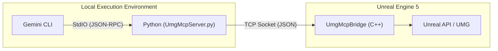

[中文版点击这里](Readme_zh.md)

# UE5-UMG-MCP 🤖📄

**A Version-Controlled AI-Assisted UMG Workflow**

[](https://agentseal.org/mcp/https-githubcom-winyunq-unrealmotiongraphicsmcp)[](https://discord.gg/mKVFxuQYc)

<details>
<summary>🎬 Click to watch what UMG MCP can do</summary>

- [Demo Designed A RTS UI](https://youtu.be/O86VCzxyF5o)
- [Demo Recreating the UE5 editor](https://youtu.be/h_J70I0m4Ls)
- [Demo Recreating the UE5 editor in UMG editor](https://youtu.be/pq12x2MH1L4)
- [Chat with Gemini 3 to editor the UMG file](https://youtu.be/93_Fiil9nd8)

</details>

---

<details>
<summary>🛍️ <a href="https://www.fab.com/zh-cn/listings/f70dbcb0-11e4-46bf-b3f7-9f30ba2c9b71">Looking for an easier Setup? → Purchase UMG MCP on Fab Marketplace</a></summary>

If you find manual plugin configuration and MCP environment setup too cumbersome, check out our commercial version on **Fab**:
[**UMG MCP on Fab Marketplace**](https://www.fab.com/zh-cn/listings/f70dbcb0-11e4-46bf-b3f7-9f30ba2c9b71)

**Differences between Fab and Open Source versions:**
- **Out-of-the-Box**: The Fab version installs directly via the Unreal Engine launcher, eliminating the need for manual cloning and Python environment setup.
- **Context Compression**: The Fab version includes advanced context management, automatically filtering redundant MCP history to maximize available tokens for the AI.
- **Commercial Focus**: While the Open Source version is our protocol testbed, the Fab version is optimized for production business logic. Commercial users receive prioritized support for their specific integration challenges.
- **Maintained Parity**: We remain committed to open source; all core logic improvements will continue to be synced to this GitHub repository.

---

👉 [View Developer Program](#developer-program) — contribute to the project and get Fab access for free.

</details>

---

<details>
<summary>🚀 Quick Start</summary>

This guide covers the two-step process to install the `UmgMcp` plugin and connect it to your Gemini CLI.

*   **Prerequisite:** Unreal Engine 5.6 or newer.

#### 1. Install the Plugin

1.  **Navigate to your project's Plugins folder:** `YourProject/Plugins/` (create it if it doesn't exist).
2.  **Clone the repository** directly into this directory:

    ```bash
    git clone https://github.com/winyunq/UnrealMotionGraphicsMCP.git UmgMcp
    ```

3.  **Restart the Unreal Editor.** This allows the engine to detect and compile the new plugin.

#### 2. Connect the Gemini CLI

Tell Gemini how to find and launch the MCP server.

1.  **Edit your `settings.json`** file (usually located at `C:\Users\YourUsername\.gemini\`).
2.  **Add the tool definition** to the `mcpServers` object.

    ```json
    "mcpServers": {
      "UmgMcp": {
        "command": "uv",
        "args": [
          "run",
          "--directory",
          "D:\\Path\\To\\YourUnrealProject\\Plugins\\UmgMcp\\Resources\\Python",
          "UmgMcpServer.py"
        ]
      }
    }
    ```

    **IMPORTANT:** You **must** replace the path with the correct **absolute path** to the `Resources/Python` folder from the cloned repository on your machine.

That's it! When you start the Gemini CLI, it will automatically launch the MCP server in the background.

#### Testing the Connection

After restarting your Gemini CLI and opening your Unreal project, you can test the connection by calling any tool function:

```python
  cd Resources/Python/APITest
  python UE5_Editor_Imitation.py
```

#### Python Environment (Optional)

The plugin's Python environment is managed by `uv`. In most cases, it should work automatically. If you encounter issues related to Python dependencies (e.g., `uv` command not found or module import errors), you can manually set up the environment:

1.  Navigate to the directory: `cd YourUnrealProject/Plugins/UmgMcp/Resources/Python`
2.  Run the setup:
    ```bash
    uv venv
    .\.venv\Scripts\activate
    uv pip install -e .
    ```

</details>

---

<details>
<summary>🧪 Experimental: Gemini CLI Skill Support</summary>

We are experimenting with the **Gemini CLI Skill** system as an alternative to the standard MCP approach.
The Skill architecture allows the Python tools to be loaded directly by the CLI runtime, potentially **optimizing context usage** by dynamically enabling/disabling tools via `prompts.json` and avoiding the overhead of managing a separate MCP server process.

> **Note**: The MCP server (configured above) is still the stable and recommended way to use this plugin. Use Skill mode if you want to test the latest integration capabilities.

#### Configuration (Skill Mode)

To enable Skill mode, add the following to your `settings.json` (replacing `<YOUR_PROJECT_PATH>`):

```json
  "skills": {
    "unreal_umg": {
      "path": "<YOUR_PROJECT_PATH>/Plugins/UmgMcp/Resources/Python/UmgMcpSkills.py",
      "type": "local",
      "description": "Direct control of Unreal Engine UMG via Python Skills. Auto-loads tools from prompts.json."
    }
  },
```

</details>

---

This project provides a powerful, command-line driven workflow for managing Unreal Engine's UMG UI assets. By treating **human-readable `.json` files as the sole Source of Truth**, it fundamentally solves the challenge of versioning binary `.uasset` files in Git.

Inspired by tools like `blender-mcp`, this system allows developers, UI designers, and AI assistants to interact with UMG assets programmatically, enabling true Git collaboration, automated UI generation, and iteration.

---

<details>
<summary>📋 Prompt Manager</summary>

A visual web tool for configuring system instructions, tool descriptions, and user prompt templates.

### Features

1.  **System Instruction Editor**: Modify the global instructions for the AI context.
2.  **Tool Management**:
    *   **Enable/Disable**: Toggle specific MCP tools on or off. Disabled tools are not registered with the MCP server, effectively **compressing the context window** to prevent AI distraction.
    *   **Edit Descriptions**: Customize tool descriptions (prompts) to better suit your workflow.
3.  **User Templates (Prompts)**: Add reusable prompt templates for quick access by the MCP client.

### How to Run

Execute the following command in your Python environment:
```bash
python Resources/Python/PromptManager/server.py
```
The browser will automatically open `http://localhost:8085`.

### Usage Tips

Prompts are crucial for AI tool effectiveness. Use the Prompt Manager to tailor the AI's behavior:

*   **One-Click Deployment Mode**: If you want the AI to focus solely on generating UI from design, disable all tools except `apply_layout` and `export_umg_to_json`.
*   **Tutor Mode**: If you want the AI to guide you without making changes, keep only read-only tools (e.g., `get_widget_tree`, `get_widget_schema`).
*   **Context Optimization**: For models with smaller context windows, disable tools you aren't currently using to improve speed and accuracy.

Contributions of effective prompt configurations are welcome!

</details>

---

<details>
<summary>🏗️ Current Technical Architecture</summary>

The system now primarily relies on the `UE5_UMG_MCP` plugin for communication between external clients (like this CLI) and the Unreal Engine Editor.

**Architecture Diagram:**


```mermaid
flowchart LR
    subgraph "Local Execution Environment"
        CLI["Gemini CLI"] --"StdIO (JSON-RPC)"--> PY["Python (UmgMcpServer.py)"]
    end

    subgraph "Unreal Engine 5"
        PY --"TCP Socket (JSON)"--> TCP["UmgMcpBridge (C++)"]
        TCP --> API["Unreal API / UMG"]
    end
```

</details>

---

<details>
<summary>⚖️ AI Authorship &amp; Disclaimer</summary>

This project has been developed with significant assistance from **Gemini, an AI**. As such:
*   **Experimental Nature**: This is an experimental project. Its reliability is not guaranteed.
*   **Commercial Use**: Commercial use is not recommended without thorough independent validation and understanding of its limitations.
*   **Disclaimer**: Use at your own risk. The developers and AI are not responsible for any consequences arising from its use.

</details>

---

## UMG Widget API Status

| Category                    | API Name                         | Status | Description                                                                                      |
| --------------------------- | -------------------------------- | :----: | ------------------------------------------------------------------------------------------------ |
| **Context & Attention**     | `get_target_umg_asset`           |   ✅    | Get the current active UMG asset path.                                                           |
|                             | `set_target_umg_asset`           |   ✅    | Set or create the target UMG asset.                                                             |
|                             | `get_last_edited_umg_asset`      |   ✅    | Get the last edited UMG asset path.                                                              |
|                             | `get_recently_edited_umg_assets` |   ✅    | Get recently edited UMG assets list.                                                             |
| **Sensing & Querying**      | `get_widget_tree`                |   ✅    | Get children of the widget target and show them as a tree (highly token-efficient).              |
|                             | `query_widget_properties`        |   ✅    | Query specific properties of a widget.                                                           |
|                             | `get_creatable_widget_types`     |   ✅    | Get all creatable widget classes.                                                                |
|                             | `get_widget_schema`              |   ✅    | Get the property schema of a widget class.                                                       |
|                             | `get_layout_data`                |   ✅    | Get screen-space layout bounding boxes.                                                          |
|                             | `check_widget_overlap`           |   ✅    | Check if there are overlapping widgets.                                                          |
| **Actions & Modifications** | `create_widget`                  |   ✅    | Create a new widget.                                                                             |
|                             | `delete_widget`                  |   ✅    | Delete a widget.                                                                                 |
|                             | `set_widget_properties`          |   ✅    | Set properties of a widget (omit widget_name to target active widget; union write fashion).      |
|                             | `reparent_widget`                |   ✅    | Move a widget to a new parent.                                                                   |
|                             | `save_asset`                     |   ✅    | Save the active UMG asset.                                                                       |
| **File Transformation**     | `export_umg_to_json`             |   ✅    | Export UMG asset to JSON format.                                                                 |
|                             | `apply_json_to_umg`              |   ✅    | Apply JSON layout definition to UMG asset.                                                       |
|                             | `apply_layout`                   |   ✅    | Apply bulk layout definition (HTML/JSON).                                                        |


## UMG Blueprint API Status (New)

| Category                    | API Name                  | Status | Description                                                                                      |
| --------------------------- | ------------------------- | :----: | ------------------------------------------------------------------------------------------------ |
| **Context & Attention**     | `set_edit_function`       |   ✅    | Set the current edit context (Function/Event). Supports auto-creating Custom Events.             |
|                             | `set_cursor_node`         |   ✅    | Explicitly set the "Cursor" node (Program Counter).                                              |
| **Sensing & Querying**      | `get_function_nodes`      |   ✅    | Get nodes in **Current Context Scope** (Filtered to connected graph to avoid global noise).      |
|                             | `get_variables`           |   ✅    | Get list of member variables.                                                                    |
|                             | `search_function_library` |   ✅    | Search callable libraries (C++/BP). Supports Fuzzy Search.                                       |
| **Actions & Modifications** | `add_step(name)`          |   ✅    | **Core**: Add executable node by Name (e.g. "PrintString"). Auto-Wiring & Auto-Layout supported. |
|                             | `prepare_value(name)`     |   ✅    | Add Data Node by Name (e.g. "MakeLiteralString", "GetVariable").                                 |
|                             | `connect_data_to_pin`     |   ✅    | Connect pins precisely (Supports `NodeID:PinName` format).                                       |
|                             | `add_variable`            |   ✅    | Add new member variable.                                                                         |
|                             | `delete_variable`         |   ✅    | Delete member variable.                                                                          |
|                             | `delete_node`             |   ✅    | Delete specific node.                                                                            |
|                             | `compile_blueprint`       |   ✅    | Compile and apply changes.                                                                       |

## UMG Sequencer API Status

| Command                          | Status | Description                                                                                                      |
| :------------------------------- | :----: | :--------------------------------------------------------------------------------------------------------------- |
| `animation_target`               |   ✅    | Set/focus the current animation (alias of `set_animation_scope`, auto-creates when missing).                     |
| `widget_target`                  |   ✅    | Set/focus the current widget (alias of `set_widget_scope`).                                                      |
| `animation_overview`             |   ✅    | Returns keyframe counts, track counts, key times, and changed properties.                                        |
| `animation_widget_properties`    |   ✅    | Timeline view: per-widget property changes (ignores unanimated properties).                                      |
| `animation_time_properties`      |   ✅    | Time-slice view: property values at specific times (multi-time supported).                                       |
| `animation_append_widget_tracks` |   ✅    | Append/overwrite keys per widget+property (union only, no implicit deletion).                                    |
| `animation_append_time_slice`    |   ✅    | Append a diff-style time slice for multiple widgets at a given time.                                             |
| `animation_delete_widget_keys`   |   ✅    | Scoped delete for widget+property at specific times (`confirm_delete=true` required per Issue 15 safety policy). |
| `create_animation`               |   ✅    | Create or focus an animation with auto naming.                                                                   |
| `set_property_keys`              |   ✅    | Low-level track write helper (supports float/color/vector2D).                                                    |

Notes:
- `animation_target`/`widget_target` reuse the current UMG target asset; names are auto-corrected (no “animal” typo) and auto-create when missing.
- Write paths are union/overwrite only—no implicit deletion. Use `animation_delete_widget_keys` with `confirm_delete=true` for scoped removals.
- Responses now include counts/timeline context so every sequencer MCP returns actionable data.

## UMG Material API Status

| Command           | Status | Description                                                                                                      |
| ----------------- | :----: | ---------------------------------------------------------------------------------------------------------------- |
| `hlsl_set_target` |   ✅    | Lock/create the HLSL target material. New assets default to UI; pass type fields for non-UMG materials.          |
| `hlsl_get`        |   ✅    | Read current HLSL code, structured parameters, and the semantic output contract.                                  |
| `hlsl_set`        |   ✅    | Union-style write for HLSL, parameters, and extra outputs: overwrite existing items and append missing ones.      |
| `hlsl_delete`     |   ✅    | Explicitly delete HLSL parameters or outputs with `confirm_delete=true`; add `kind` only when a name is ambiguous. |
| `hlsl_compile`    |   ✅    | Compile current HLSL target and return concise diagnostics for AI post-processing.                                |

### HLSL Protocol Contract (UMG-Optimized)

- Material is treated as a single HLSL program.
- Backend assumes HLSL returns `float4`.
- Output auto-wiring is semantic: UI/Post Process/Light Function/Unlit routes rgb to `EmissiveColor`; Lit Surface routes rgb to `BaseColor`; alpha only connects to `Opacity` or `OpacityMask` when needed.
- Extra material outputs use UE 5.8 Custom node `AdditionalOutputs`, so one HLSL block can drive `Roughness`, `Metallic`, `Normal`, `WorldPositionOffset`, and similar root outputs.
- Input parameters are returned as structured descriptors (`name`, `kind`, `source_handle`) for learning/replay by AI agents.
- `hlsl_set` only performs union overwrite/append operations. Deletion must use `hlsl_delete(confirm_delete=true)`.
- Low-level `material_*` graph tools are kept as a compatibility layer, but the Material ToolMode exposes the HLSL loop by default.

## UMG Style & Theming API Status (New)

| Category    | API Name             |  Status   | Description                                                                   |
| ----------- | -------------------- | :-------: | ----------------------------------------------------------------------------- |
| **Styling** | `set_widget_style`   | 🚧 Planned | Set detailed style (e.g. FButtonStyle) for a specific widget.                 |
| **Theming** | `apply_global_theme` | 🚧 Planned | Batch apply styles and fonts across multiple widgets based on a theme config. |
| **Assets**  | `style_create_asset` | 🚧 Planned | Create a standalone Slate Widget Style asset.                                 |

---

## Developer Program

> We notice there are many forks but few PRs — here's your invitation to change that.

<details>
<summary>❓ What is the Developer Program & Why does it exist?</summary>

We are living in the age of AI. Everyone now has the ability to build and contribute to projects with AI assistance. UMG MCP is sincerely provided free of charge for everyone to learn and use — and this should include the Fab version too.

By joining the Developer Program and meeting the contribution criteria, **you will gain access to the private repository during your active development period**.

</details>

<details>
<summary>🎁 Why is the reward a Fab version license?</summary>

The only reason the Fab version is paid is an economic reality: if it were free, the average social return on labor would drop dramatically. Charging for it is the only mechanism to sustain development. The Fab version of UMG MCP *should* be free — but making it truly free would only force us to work harder for less. Therefore, rewarding contributors with a Fab license serves two purposes: it gives you access to the more polished version, and it gives you the ability to maintain the real, production-grade project.

</details>

<details>
<summary>🛠️ How to join the UMG MCP Developer Program?</summary>

This is admittedly a bit of a paradox — UMG MCP is designed to serve non-programmers, and programmers may not need it as much. Regardless, here are the paths to contribute:

**Path 1 — Video Content:**
Create a video specifically about the UMG MCP **Fab version**. Reach a meaningful audience and we'll count it.

**Path 2 — Feature Development:**
Our design philosophy is simple: *if your tool gets accepted, you're in*. Develop a feature, submit a PR, and if we merge it, you qualify.

**Path 3 — Prompt Engineering:**
Write system prompts that help the AI more accurately identify and invoke the correct tools — even when all tools are enabled simultaneously. Precision matters here.

**Path 4 — Purchase the Fab version:**
If you've purchased it, you already have the right to access this project. Simple as that.

**To apply:** Send your GitHub profile to **winyunq@gmail.com**

</details>
