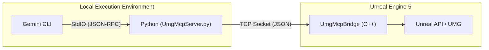

[Click here for English version](Readme.md)

# UE5-UMG-MCP 🤖📄

**一个以版本控制为核心的AI协同UMG工作流**


[一个简单的RTS界面](https://www.bilibili.com/video/BV1mCUpBwEnc)
---

### 🚀 快速开始

本指南包含安装 `UmgMcp` 插件并连接到 Gemini CLI 的两个核心步骤。

    ```bash
    git clone https://github.com/winyunq/UnrealMotionGraphicsMCP.git UmgMcp
    ```

3.  **重启Unreal编辑器。** 这将允许引擎检测并编译新插件。

#### 2. 连接 Gemini CLI

告诉 Gemini 如何找到并启动 MCP 服务器。

1.  **编辑您的 `settings.json` 文件** (通常位于 `C:\Users\您的用户名\.gemini\`)。
2.  **将工具定义添加**到 `tools` 对象中。

    ```json
    "mcpServers": {
      "UmgMcp": {
        "command": "uv",
        "args": [
          "run",
          "--directory",
          "D:\\您的项目路径\\Plugins\\UmgMcp\\Resources\\Python",
          "UmgMcpServer.py"
        ]
      },
      "UmgSequencer": {
        "command": "uv",
        "args": [
          "run",
          "--directory",
          "D:\\您的项目路径\\Plugins\\UmgMcp\\Resources\\Python",
          "UmgSequencerServer.py"
        ]
      }
    }
    ```
    **重要提示:** 您 **必须** 将路径替换为您机器上克隆仓库后 `Resources/Python` 文件夹的**绝对路径**。

完成！当您启动 Gemini CLI 时，它会自动在后台启动 MCP 服务器。

#### 测试连接

重启 Gemini CLI 并打开您的 Unreal 项目后，您可以直接调用任何工具函数来测试连接：
```python
  cd Resources/Python/APITest
  python UE5_Editor_Imitation.py
```

#### Python 环境 (可选)

插件的 Python 环境由 `uv` 管理，在大多数情况下会自动运行。如果您遇到与 Python 依赖相关的问题（例如 `uv` 命令找不到或模块导入错误），可以手动设置环境：

1.  进入目录: `cd 您的Unreal项目/Plugins/UmgMcp/Resources/Python`
2.  运行设置:
    ```bash
    uv venv
    .\.venv\Scripts\activate
    uv pip install -e .
    ```

---

## 提示词管理器 (Prompt Manager)

这是一个可视化的 Web 工具，用于配置 MCP 服务器的系统提示词、工具描述以及用户模板。

### 功能亮点

1.  **系统提示词编辑**：直接修改 AI 的全局指令。
2.  **工具管理**：
    *   **启用/禁用**：通过开关（Toggle）来启用或禁用特定的 MCP 工具。禁用工具后，该工具将不会注册到 MCP 服务器，从而**压缩上下文窗口**，避免 AI 被无关工具干扰。
    *   **编辑描述**：修改工具的提示词（Description），使其更适合您的特定工作流。
3.  **用户模板 (Prompts)**：添加预置的 Prompts，供 MCP 客户端直接调用。

### 运行方法

在 Python 环境下运行以下命令：
```bash
python Resources/Python/PromptManager/server.py
```
浏览器将自动打开 `http://localhost:8085`。

### 使用建议

提示词是 AI 工具效能的关键。通过 Prompt Manager，您可以根据需求定制 AI 的行为：

*   **一键部署模式**：如果您希望 AI 专注于根据设计生成 UI，可以关闭除了 `apply_layout` 和 `export_umg_to_json` 之外的所有工具。
*   **教学模式**：如果您希望 AI 作为导师指导您学习 UMG，可以只保留只读工具（如 `get_widget_tree`, `get_widget_schema`），防止 AI 自动修改您的资产。
*   **上下文优化**：对于上下文窗口较小的模型，建议关闭您当前任务不需要的工具，以提高响应速度和准确性。

欢迎贡献高效的提示词配置，让 AI 更聪明地工作！

---

### AI 作者与免责声明

本项目在 **Gemini AI** 的大力协助下开发。因此：
*   **实验性质**: 这是一个实验性项目。其可靠性不作保证。
*   **商业用途**: 在未经过彻底的独立验证并充分理解其局限性之前，不建议用于商业用途。
*   **免责声明**: 使用风险自负。开发者和AI对因使用本项目而产生的任何后果概不负责。

---

### 当前技术架构概览

该系统现在主要依赖 `UE5_UMG_MCP` 插件，用于外部客户端（如本CLI）与Unreal Engine编辑器之间的通信。

**架构图:** 



## API 实现状态

| 分类 | API 名称 | 状态 | 描述 |
|---|---|:---:|---|
| **上下文与注意力** | `get_target_umg_asset` | ✅ | 获取当前操作的UMG资产。 |
| | `set_target_umg_asset` | ✅ | 设置全局操作的UMG资产目标。 |
| | `get_last_edited_umg_asset` | ✅ | 获取最后编辑的UMG资产。 |
| | `get_recently_edited_umg_assets` | ✅ | 获取最近编辑过的UMG资产列表。 |
| **感知与查询** | `get_widget_tree` | ✅ | 获取资产的完整控件树结构。 |
| | `query_widget_properties` | ✅ | 查询特定控件的一个或多个属性值。 |
| | `get_creatable_widget_types` | ✅ | 获取所有可以被创建的控件类型列表。 |
| | `get_widget_schema` | ✅ | 获取指定控件类型的属性结构信息。 |
| | `get_layout_data` | ✅ | 获取所有控件在给定分辨率下的屏幕布局数据。 |
| | `check_widget_overlap` | ✅ | 检查UI布局中是否有控件发生重叠。 |
| **操作与修改** | `create_widget` | ✅ | 创建一个新的控件并附加到父控件。 |
| | `delete_widget` | ✅ | 根据名称删除一个控件。 |
| | `set_widget_properties` | ✅ | 设置一个或多个控件属性。 |
| | `reparent_widget` | ✅ | 将一个控件移动到新的父控件下。 |
| | `save_asset` | ✅ | 保存当前的UMG资产。 |
| **文件转换** | `export_umg_to_json` | ✅ | 将UMG资产导出为JSON字符串。 |
| | `apply_json_to_umg` | ✅ | 将JSON数据应用到UMG资产。 |
| | `apply_layout` | ✅ | 将HTML/XML布局应用到UMG资产。 |

## UMG Sequencer API 实现状态

| 分类 | API 名称 | 状态 | 描述 |
|---|---|:---:|---|
| **动画管理** | `get_all_animations` | ✅ | 获取所有动画列表。 |
| | `create_animation` | ✅ | 创建新的动画序列。 |
| | `delete_animation` | ✅ | 删除指定的动画序列。 |
| | `set_animation_scope` | ✅ | 设置后续命令的目标动画。 |
| | `set_widget_scope` | ✅ | 设置后续命令的目标控件。 |
| **轨道与关键帧** | `set_property_keys` | ✅ | 设置属性的关键帧（目前仅支持浮点）。 |
| | `remove_property_track` | ⏳ | 移除属性轨道。 |
| | `remove_keys` | ⏳ | 移除特定关键帧。 |
| | `get_animation_keyframes` | ⏳ | 获取动画的关键帧数据。 |
| | `get_animated_widgets` | ⏳ | 获取受动画影响的控件列表。 |

## 故障排除与已知问题

> [!WARNING]
> **这很重要：关于启动顺序**
> 我们发现 MCP 的连接机制对顺序非常敏感。**你必须先启动 UE5 项目**，等待它初始化完毕，**然后再启动 Gemini CLI**。
>
> 如果你先启动 CLI，Python 服务器可能会因为连接不上 UE5 而进入奇怪的状态，导致连接失败或者只有在你杀死进程时才突然连接成功（Success-on-kill）。请务必遵循 **"UE5 先行，CLI 后行"** 的原则。
