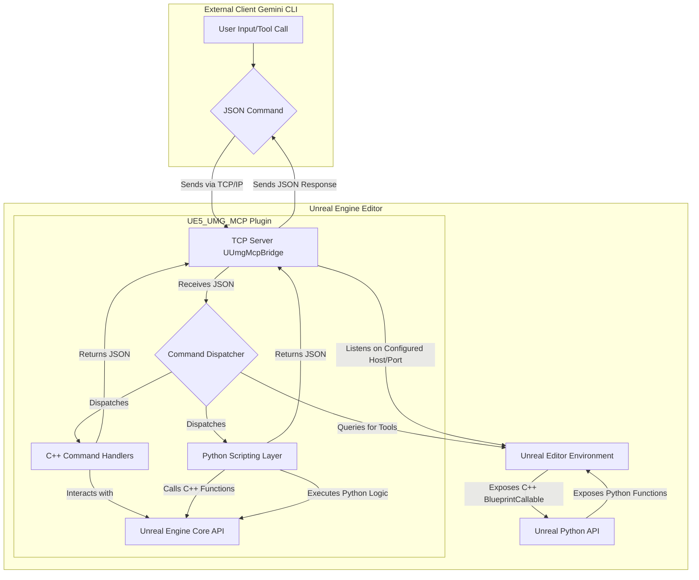

[Click here for English version](Readme.md)

# UE5-UMG-MCP 🤖📄

**一个以版本控制为核心的AI协同UMG工作流**


---

### 🚀 快速开始

本节将指导您如何设置和使用UMG-MCP插件。

#### 1. 先决条件

*   **Unreal Engine 5.5+**: 确保您已安装Unreal Engine 5.5或更高版本。
*   **Python 3.12+**: 推荐使用Python 3.12或更高版本。
*   **Git**: 用于克隆项目仓库。
*   **`uv` (推荐) 或 `pip`**: 用于管理Python虚拟环境和依赖。

#### 2. 插件安装

**选项 A: 克隆仓库并安装插件 (推荐)**

1.  **克隆仓库:**
    ```bash
    git clone https://github.com/winyunq/UnrealMotionGraphicsMCP
    cd UnrealMotionGraphicsMCP
    ```
2.  **运行安装脚本:**
    此脚本会将插件复制到您的Unreal Engine安装目录或项目目录。
    请将 `[您的UE安装路径]` 替换为您的实际Unreal Engine安装路径（例如，`"C:\Program Files\Epic Games\UE_5.3"`）。端口号是可选的，默认为 `54517`。

    ```bash
    install_to_engine.bat "[您的UE安装路径]" [端口号, 默认为54517]
    ```

#### 3. Python环境设置

导航到插件的Python资源目录，并设置虚拟环境：

```bash
cd Resources/Python
uv venv # 或使用 python -m venv .venv
.\.venv\Scripts\activate # Windows
# source ./.venv/bin/activate # macOS/Linux
uv pip install -e . # 或使用 pip install -e .
```

#### 4. 配置Gemini CLI (`settings.json`)

您需要将MCP服务器工具定义添加到Gemini CLI的 `settings.json` 文件中。

*   `settings.json` 通常位于 `C:\Users\您的用户名\.gemini\settings.json` (Windows) 或 `~/.gemini/settings.json` (macOS/Linux)。
*   在 `settings.json` 的 `tools` 部分添加以下JSON片段：

```json
"UmgMcp": {
  "command": "uv",
  "args": [
    "--directory",
    "[插件路径]\\Resources\\Python",
    "run",
    "UmgMcpServer.py"
  ]
}
```
*   请确保将 `[插件路径]` 替换为您的实际插件Python资源目录的绝对路径（例如，`D:\ModelContextProtocol\unreal-engine-mcp\FlopperamUnrealMCP\Plugins\UE5_UMG_MCP`）。

#### 5. 启动MCP服务器

*   首先，**启动Unreal Engine编辑器**。
*   在Gemini CLI中，运行以下命令来启动MCP服务器：

```python
default_api.UmgMcp()
```
*   服务器将在后台运行。

#### 6. 测试通信

一旦服务器启动，您就可以测试与Unreal Engine的通信了：

```python
print(default_api.get_last_edited_umg_asset())
# 预期输出示例: {"status": "success", "result": {"status": "success", "asset_path": "/Game/YourAssetPath"}}
```

---

### AI 作者与免责声明

本项目在 **Gemini AI** 的大力协助下开发。因此：
*   **实验性质**: 这是一个实验性项目。其可靠性不作保证。
*   **商业用途**: 在未经过彻底的独立验证并充分理解其局限性之前，不建议用于商业用途。
*   **免责声明**: 使用风险自负。开发者和AI对因使用本项目而产生的任何后果概不负责。

---

### 当前技术架构概览

该系统现在主要依赖 `UE5_UMG_MCP` 插件，用于外部客户端（如本CLI）与Unreal Engine编辑器之间的通信。

**架构图:** 



## API 实现状态

| 分类 | API 名称 | 状态 | 描述 |
|---|---|:---:|---|
| **上下文与注意力** | `get_target_umg_asset` | ✅ | 获取当前操作的UMG资产。 |
| | `set_target_umg_asset` | ✅ | 设置全局操作的UMG资产目标。 |
| | `get_last_edited_umg_asset` | ✅ | 获取最后编辑的UMG资产。 |
| | `get_recently_edited_umg_assets` | ✅ | 获取最近编辑过的UMG资产列表。 |
| **感知与查询** | `get_widget_tree` | ✅ | 获取资产的完整控件树结构。 |
| | `query_widget_properties` | ✅ | 查询特定控件的一个或多个属性值。 |
| | `get_creatable_widget_types` | ❌ | 获取所有可以被创建的控件类型列表。 |
| | `get_widget_schema` | ❌ | 获取指定控件类型的属性结构信息。 |
| | `get_layout_data` | ❌ | 获取所有控件在给定分辨率下的屏幕布局数据。 |
| | `check_widget_overlap` | ❌ | 检查UI布局中是否有控件发生重叠。 |
| **操作与修改** | `create_widget` | ❌ | 创建一个新的控件并附加到父控件。 |
| | `delete_widget` | ❌ | 根据名称删除一个控件。 |
| | `set_widget_properties` | ❌ | 设置一个或多个控件属性。 |
| | `reparent_widget` | ❌ | 将一个控件移动到新的父控件下。 |
| **文件转换** | `export_umg_to_json` | ✅ | 将UMG资产导出为JSON字符串。 |
| | `apply_json_to_umg` | ✅ | 将JSON数据应用到UMG资产。
```