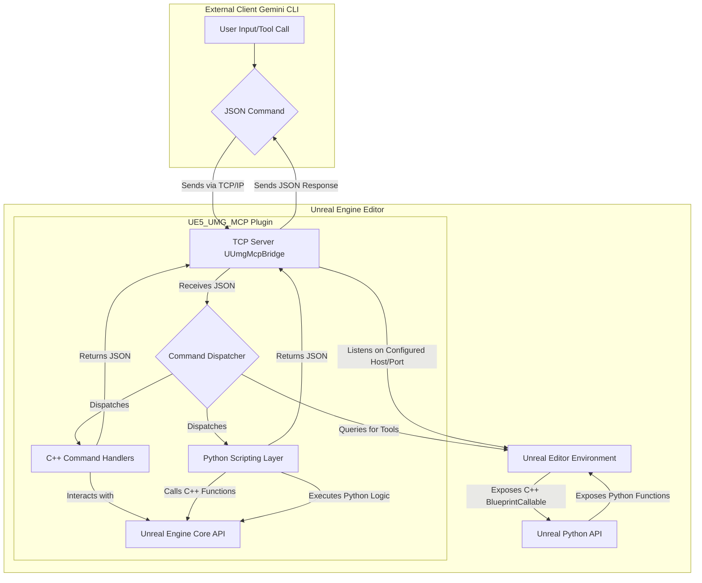

[Click here for English version](Readme.md)

# UE5-UMG-MCP 🤖📄

**一个以版本控制为核心的AI协同UMG工作流**


---

### 🚀 快速开始

本指南包含安装 `UmgMcp` 插件并连接到 Gemini CLI 的两个核心步骤。

    git clone https://github.com/winyunq/UnrealMotionGraphicsMCP.git UmgMcp
    ```

3.  **重启Unreal编辑器。** 这将允许引擎检测并编译新插件。

#### 2. 连接 Gemini CLI

告诉 Gemini 如何找到并启动 MCP 服务器。

1.  **编辑您的 `settings.json` 文件** (通常位于 `C:\Users\您的用户名\.gemini\`)。
2.  **将工具定义添加**到 `tools` 对象中。

    ```json
    "UmgMcp": {
      "command": "uv",
      "args": [
        "run",
        "--directory",
        "D:\\您的项目路径\\Plugins\\UmgMcp\\Resources\\Python",
        "UmgMcpServer.py"
      ]
    }
    ```
    **重要提示:** 您 **必须** 将路径替换为您机器上克隆仓库后 `Resources/Python` 文件夹的**绝对路径**。

完成！当您启动 Gemini CLI 时，它会自动在后台启动 MCP 服务器。

#### 测试连接

重启 Gemini CLI 并打开您的 Unreal 项目后，您可以直接调用任何工具函数来测试连接：
```python
print(default_api.get_target_umg_asset())
```

#### Python 环境 (可选)

插件的 Python 环境由 `uv` 管理，在大多数情况下会自动运行。如果您遇到与 Python 依赖相关的问题（例如 `uv` 命令找不到或模块导入错误），可以手动设置环境：

1.  进入目录: `cd 您的Unreal项目/Plugins/UmgMcp/Resources/Python`
2.  运行设置:
    ```bash
    uv venv
    .\.venv\Scripts\activate
    uv pip install -e .
    ```

---

### AI 作者与免责声明

本项目在 **Gemini AI** 的大力协助下开发。因此：
*   **实验性质**: 这是一个实验性项目。其可靠性不作保证。
*   **商业用途**: 在未经过彻底的独立验证并充分理解其局限性之前，不建议用于商业用途。
*   **免责声明**: 使用风险自负。开发者和AI对因使用本项目而产生的任何后果概不负责。

---

### 当前技术架构概览

该系统现在主要依赖 `UE5_UMG_MCP` 插件，用于外部客户端（如本CLI）与Unreal Engine编辑器之间的通信。

**架构图:** 



## API 实现状态

| 分类 | API 名称 | 状态 | 描述 |
|---|---|:---:|---|
| **上下文与注意力** | `get_target_umg_asset` | ✅ | 获取当前操作的UMG资产。 |
| | `set_target_umg_asset` | ✅ | 设置全局操作的UMG资产目标。 |
| | `get_last_edited_umg_asset` | ✅ | 获取最后编辑的UMG资产。 |
| | `get_recently_edited_umg_assets` | ✅ | 获取最近编辑过的UMG资产列表。 |
| **感知与查询** | `get_widget_tree` | ✅ | 获取资产的完整控件树结构。 |
| | `query_widget_properties` | ✅ | 查询特定控件的一个或多个属性值。 |
| | `get_creatable_widget_types` | ❓ | 获取所有可以被创建的控件类型列表。 |
| | `get_widget_schema` | ❌ | 获取指定控件类型的属性结构信息。 (Planned) |
| | `get_layout_data` | ✅ | 获取所有控件在给定分辨率下的屏幕布局数据。 |
| | `check_widget_overlap` | ✅ | 检查UI布局中是否有控件发生重叠。 |
| **操作与修改** | `create_widget` | ✅ | 创建一个新的控件并附加到父控件。 |
| | `delete_widget` | ✅ | 根据名称删除一个控件。 |
| | `set_widget_properties` | ✅ | 设置一个或多个控件属性。 |
| | `reparent_widget` | ✅ | 将一个控件移动到新的父控件下。 |
| **文件转换** | `export_umg_to_json` | ✅ | 将UMG资产导出为JSON字符串。 |
| | `apply_json_to_umg` | ✅ | 将JSON数据应用到UMG资产。

##  `apply_json_to_umg` 是可以工作的，因此如果需要AI编辑你的UMG，最好的办法是给个模板，然后让AI执行 `export_umg_to_json` 知道如何表示UMG资产，然后让他运行 `apply_json_to_umg`