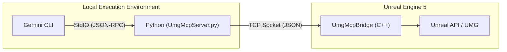

[English version please click here](Readme.md)

# UE5-UMG-MCP 🤖📄

**版本受控的 AI 辅助 UMG 工作流**


[Demo 设计 RTS UI](https://youtu.be/O86VCzxyF5o)

[Demo 在 UMG 窗口中复现 UE5 编辑器预览](https://youtu.be/h_J70I0m4Ls)

[Demo 在 UMG 编辑器中操作 UMG 控件](https://youtu.be/pq12x2MH1L4)

[与 Gemini 3 对话编辑 UMG 文件](https://youtu.be/93_Fiil9nd8)

---

### 🚀 快速开始

本指南涵盖了安装 `UmgMcp` 插件并将其连接到 Gemini CLI 的两个步骤。

*   **前提条件：** Unreal Engine 5.6 或更高版本。

#### 1. 安装插件 (Install the Plugin)

1.  **进入项目的 Plugins 文件夹：** `YourProject/Plugins/`（如果不存在则创建）。
2.  **直接克隆仓库**到此目录：

    ```bash
    git clone https://github.com/winyunq/UnrealMotionGraphicsMCP.git UmgMcp
    ```

3.  **重启 Unreal Editor。** 这允许引擎检测并编译新插件。

#### 2. 连接 Gemini CLI (Connect the Gemini CLI)

告诉 Gemini 如何找到并启动 MCP 服务器。

1.  **编辑您的 `settings.json`** 文件（通常位于 `C:\Users\用户名\.gemini\`）。
2.  **将工具定义添加**到 `mcpServers` 对象中。

    ```json
    "mcpServers": {
      "UmgMcp": {
        "command": "uv",
        "args": [
          "run",
          "--directory",
          "D:\\Path\\To\\YourUnrealProject\\Plugins\\UmgMcp\\Resources\\Python",
          "UmgMcpServer.py"
        ]
      }
    }
    ```

    **注意：** 您**必须**将路径替换为您机器上克隆仓库中 `Resources/Python` 文件夹的正确**绝对路径**。

就是这样！当您启动 Gemini CLI 时，它将自动在后台启动 MCP 服务器。

#### 测试连接

重启 Gemini CLI 并打开 Unreal 项目后，您可以通过调用任何工具函数来测试连接：

```python
  cd Resources/Python/APITest
  python UE5_Editor_Imitation.py
```

#### Python 环境（可选）

插件的 Python 环境由 `uv` 管理。在大多数情况下，它应该会自动工作。如果您遇到与 Python 依赖项相关的问题（例如找不到 `uv` 命令或模块导入错误），您可以手动设置环境：

1.  导航到目录：`cd YourUnrealProject/Plugins/UmgMcp/Resources/Python`
2.  运行设置：
    ```bash
    uv venv
    .\.venv\Scripts\activate
    uv pip install -e .
    ```

---

### 🧪 实验性功能：Gemini CLI Skill 支持

我们正在尝试使用 **Gemini CLI Skill** 系统作为标准 MCP 方法的替代方案。
Skill 架构允许 Python 工具直接由 CLI 运行时加载，通过 `prompts.json` 动态启用/禁用工具，潜在地**优化上下文使用**，并避免管理独立 MCP 服务器进程的开销。

> **注意**：上面配置的 MCP 服务器仍然是使用此插件的稳定且推荐的方式。如果您想测试最新的集成能力，请使用 Skill 模式。

#### 配置 (Skill 模式)

要启用 Skill 模式，请将以下内容添加到您的 `settings.json` 中（替换 `<YOUR_PROJECT_PATH>`）：

```json
  "skills": {
    "unreal_umg": {
      "path": "<YOUR_PROJECT_PATH>/Plugins/UmgMcp/Resources/Python/UmgMcpSkills.py",
      "type": "local",
      "description": "通过 Python Skills 直接控制 Unreal Engine UMG。从 prompts.json 自动加载工具。"
    }
  },
```

---

## 简体中文 (Chinese)

本项目为管理 Unreal Engine 的 UMG UI 资产提供了一个强大的、命令行驱动的工作流。通过将 **人类可读的 `.json` 文件视为唯一的真理源 (Source of Truth)**，它从根本上解决了在 Git 中对二进制 `.uasset` 文件进行版本控制的挑战。

受 `blender-mcp` 等工具的启发，该系统允许开发人员、UI 设计师和 AI 助手以编程方式与 UMG 资产进行交互，从而实现真正的 Git 协作、自动化 UI 生成和迭代。

---

## Prompt 管理器 (Prompt Manager)

一个用于配置系统指令、工具描述和用户提示模板的可视化 Web 工具。

### 功能

1.  **系统指令编辑器**：修改针对 AI 上下文的全局指令。
2.  **工具管理**：
    *   **启用/禁用**：开启或关闭特定的 MCP 工具。禁用的工具不会在 MCP 服务器上注册，从而有效地**压缩上下文窗口**，防止 AI 分心。
    *   **编辑描述**：自定义工具描述（提示词），使其更符合您的工作流。
3.  **用户模板 (Prompts)**：添加可重用的提示词模板，方便 MCP 客户端快速访问。

### 如何运行

在您的 Python 环境中执行以下命令：
```bash
python Resources/Python/PromptManager/server.py
```
浏览器将自动打开 `http://localhost:8085`。

### 使用提示

Prompt 对 AI 工具的有效性至关重要。使用 Prompt 管理器来为 AI 量身定制其行为：

*   **一键部署模式**：如果您希望 AI 仅专注于根据设计生成 UI，请禁用除 `apply_layout` 和 `export_umg_to_json` 之外的所有工具。
*   **导师模式**：如果您希望 AI 只是进行指导而不做逻辑更改，请仅保留只读工具（例如 `get_widget_tree`, `get_widget_schema`）。
*   **上下文优化**：对于上下文窗口较小的模型，禁用当前不使用的工具以提高速度和准确性。

欢迎贡献有效的 Prompt 配置！

---

### AI 署名与免责声明

本项目是在 **Gemini (一种 AI)** 的显著协助下开发的。因此：
*   **实验性质**：这是一个实验性项目，不保证其可靠性。
*   **商业用途**：在没有经过彻底的独立验证和了解其局限性的情况下，不建议用于商业用途。
*   **免责声明**：使用风险自负。开发人员和 AI 对因使用本项目而产生的任何后果概不负责。

---

### 当前技术架构概览

系统目前主要依靠 `UE5_UMG_MCP` 插件在外部客户端（如本 CLI）与 Unreal Engine 编辑器之间进行通信。

**架构图：**



## API 实现状态

| 分类               | API 名称                         | 状态  |
| ------------------ | -------------------------------- | :---: |
| **上下文与注意力** | `get_target_umg_asset`           |   ✅   |
|                    | `set_target_umg_asset`           |   ✅   |
|                    | `get_last_edited_umg_asset`      |   ✅   |
|                    | `get_recently_edited_umg_assets` |   ✅   |
| **感知与查询**     | `get_widget_tree`                |   ✅   |
|                    | `query_widget_properties`        |   ✅   |
|                    | `get_creatable_widget_types`     |   ✅   |
|                    | `get_widget_schema`              |   ✅   |
|                    | `get_layout_data`                |   ✅   |
|                    | `check_widget_overlap`           |   ✅   |
| **动作与修改**     | `create_widget`                  |   ✅   |
|                    | `delete_widget`                  |   ✅   |
|                    | `set_widget_properties`          |   ✅   |
|                    | `reparent_widget`                |   ✅   |
|                    | `save_asset`                     |   ✅   |
| **文件转换**       | `export_umg_to_json`             |   ✅   |
|                    | `apply_json_to_umg`              |   ✅   |
|                    | `apply_layout`                   |   ✅   |

## UMG 蓝图 (Blueprint) API 实现状态 (New)

| 分类               | API 名称                  | 状态  | 描述                                                           |
| ------------------ | ------------------------- | :---: | -------------------------------------------------------------- |
| **上下文与注意力** | `set_edit_function`       |   ✅   | 设置当前编辑上下文（函数/事件）。支持自动创建自定义事件。      |
|                    | `set_cursor_node`         |   ✅   | 显式设置“光标”节点（程序计数器）。                             |
| **感知与查询**     | `get_function_nodes`      |   ✅   | 获取**当前上下文作用域**内的节点（过滤掉无关节点以减少噪音）。 |
|                    | `get_variables`           |   ✅   | 获取成员变量列表。                                             |
|                    | `search_function_library` |   ✅   | 搜索可调用的库 (C++/BP)。支持模糊搜索。                        |
| **动作与修改**     | `add_step(name)`          |   ✅   | **核心**：根据名称添加可执行节点。支持自动连线与布局。         |
|                    | `prepare_value(name)`     |   ✅   | 添加数据节点（例如 GetVariable）。                             |
|                    | `connect_data_to_pin`     |   ✅   | 精确连接引脚（支持 `NodeID:PinName` 格式）。                   |
|                    | `add_variable`            |   ✅   | 添加新的成员变量。                                             |
|                    | `delete_variable`         |   ✅   | 删除成员变量。                                                 |
|                    | `delete_node`             |   ✅   | 删除特定节点。                                                 |
|                    | `compile_blueprint`       |   ✅   | 编译并应用更改。                                               |

## UMG 动画 (Sequencer) API 实现状态

| 命令                      |   状态   | 描述                               |
| :------------------------ | :------: | :--------------------------------- |
| `set_animation_scope`     | ✅ 已实现 | 设置后续命令的目标动画             |
| `set_widget_scope`        | ✅ 已实现 | 设置后续命令的目标控件             |
| `get_all_animations`      | ✅ 已实现 | 获取蓝图中的所有动画列表           |
| `create_animation`        | ✅ 已实现 | 创建新动画                         |
| `delete_animation`        | ✅ 已实现 | 删除动画                           |
| `set_property_keys`       | ✅ 已实现 | 设置属性关键帧（目前仅支持浮点数） |
| `remove_property_track`   | 🚧 计划中 | 移除属性轨道                       |
| `remove_keys`             | 🚧 计划中 | 移除特定关键帧                     |
| `get_animation_keyframes` | 🚧 计划中 | 获取动画的关键帧数据               |
| `get_animated_widgets`    | 🚧 计划中 | 获取受动画影响的控件列表           |

## UMG 材质 (Material) API 实现状态 (New: 五大核心能力)

| 分类             | API 名称                       |   状态   | 描述                                                                   |
| ---------------- | ------------------------------ | :------: | ---------------------------------------------------------------------- |
| **P0: 上下文**   | `material_set_target`          | ⏳ 计划中 | **锚点**：指定当前编辑的材质资产（支持自动创建/重定向）。              |
| **P1: 输入定义** | `material_define_variable`     | ⏳ 计划中 | 定义外部接口参数（定义而非连线）。支持 Scalar, Vector, Texture。       |
| **P2: 符号放置** | `material_add_node`            | ⏳ 计划中 | **拖拽符号**：将 UE5 库中的符号放置到图表并分配实例句柄（Handle）。    |
|                  | `material_get_nodes`           | ⏳ 计划中 | 查询图表中的所有节点句柄及其状态。                                     |
| **P3: 连接拓扑** | `material_connect_nodes`       | ⏳ 计划中 | **自然连接**：建立节点间的逻辑映射（A -> B），模拟功能性嵌套。         |
|                  | `material_connect_pins`        | ⏳ 计划中 | **外科连线**：在复杂拓扑下手动连接特定的输入引脚。                     |
| **P4: 符号检索** | `material_search_library`      | ⏳ 计划中 | 快速检索 UE5 材质表达式库中的符号（Symbol）。                          |
| **P5: 细节注入** | `material_set_hlsl_node_io`    | ⏳ 计划中 | **战术细节**：编写 Custom 节点的 HLSL 代码并实时同步 IO 引脚。         |
|                  | `material_set_node_properties` | ⏳ 计划中 | **属性编辑**：设置常规节点（如 Constant, TextureSample）的内部属性值。 |
| **生命周期**     | `compile_asset`                | ⏳ 计划中 | 提交更改并分析 HLSL 报错。                                             |
|                  | `material_delete`              | ⏳ 计划中 | 根据唯一句柄删除实例。                                                 |

## UMG 样式与主题 (Style & Theming) API 实现状态 (New)

| 类别     | API 名称             | status | 描述                                          |
| -------- | -------------------- | :----: | --------------------------------------------- |
| **样式** | `set_widget_style`   |   ⏳    | 设置特定控件的详细样式（例如 FButtonStyle）。 |
| **主题** | `apply_global_theme` |   ⏳    | 根据主题配置批量应用样式、字体和配色。        |
| **资源** | `style_create_asset` |   ⏳    | 创建独立的 Slate 控件样式资源。               |

## 故障排除与已知问题

> [!WARNING]
> **这很重要：关于启动顺序**
> 我们发现 MCP 的连接机制对顺序非常敏感。**你必须先启动 UE5 项目**，等待它初始化完毕，**然后再启动 Gemini CLI**。
>
> 如果你先启动 CLI，Python 服务器可能会因为连接不上 UE5 而进入奇怪的状态，导致连接失败或者只有在你杀死进程时才突然连接成功（Success-on-kill）。请务必遵循 **"UE5 先行，CLI 后行"** 的原则。
