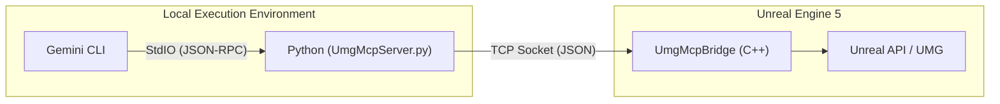

[English](Readme.md)

<div align="center">
  <h1>UnrealMotionGraphicsMCP</h1>
  <p><strong>面向 Unreal Engine UMG 自动化制作的开源 MCP 工具集。</strong></p>
  <p>
    <a href="https://winyunq.github.io/UnrealMotionGraphicsMCP/Document/index_zh.html">网页教程</a>
    · <a href="#快速开始">快速开始</a>
    · <a href="#协议文档">协议文档</a>
    · <a href="https://github.com/winyunq/UnrealMotionGraphicsMCP/issues">Issues</a>
    · <a href="https://discord.gg/yk5VEQ5S9U">Discord</a>
  </p>
  <p>
    
    
    
    <a href="https://agentseal.org/mcp/https-githubcom-winyunq-unrealmotiongraphicsmcp"></a>
  </p>
</div>

---

**UnrealMotionGraphicsMCP** 让 AI Agent 可以通过明确、可版本化的 MCP 命令编辑 Unreal UMG。它不要求 Agent 靠截图猜测，也不依赖脆弱的自动点击，而是把真实的编辑器状态暴露出来：Widget Tree、Slot 属性、Blueprint 图表操作、UI 材质、动画轨道，以及 UMG JSON 导出/回写。

开源插件是协议与编辑器桥接本体。它应该是可阅读、可调试、可复现的，适合研究、自定义管线、Issue 汇报和社区修复。

## 这个项目能做什么

| 范围 | 开源能力 |
| --- | --- |
| UMG Widget | 创建控件、读取树结构、设置属性和 Slot、重排子节点、替换子树、导出和回写 JSON |
| Blueprint / BlueCode | 创建图表节点、连接 Pin、绑定 Widget 引用、应用紧凑的代码式图表语句 |
| Material | 创建 UI 材质、设置参数、添加支持的表达式、测试面向 HLSL 的材质工作流 |
| Animation | 为 Render Transform、Opacity、Color 和 Timing 创建 UMG 动画轨道与关键帧 |
| Editor Bridge | 让外部 MCP 客户端通过 `127.0.0.1:55557` 的本机桥接调用 Unreal Editor |

## 为什么需要它

AI 辅助 UI 制作不能只靠截图。UMG 资产是结构化编辑器对象，严肃的自动化需要结构化访问。这个项目给 Agent 一个可以检查、测试和改进的协议表面，而不是把行为藏在黑盒 UI 操作里。

核心目标：

- **可观察的编辑**：每个关键 UI 修改都应该能表示为工具调用，并能作为数据审查。
- **可版本化的工作流**：UMG 可以导出为结构化 JSON，再按补丁回写。
- **编辑器原生行为**：命令通过 Unreal 编辑器系统执行，而不是模拟浏览器式点击。
- **开源协议优先**：协议、schema、测试和 bug fix 都应该保留在公开仓库。

## 快速开始

当前目标平台：**Unreal Engine 5.8 / Win64**。插件描述文件的 `EngineVersion` 是 `5.8.0`。

### 1. 安装插件

把开源插件克隆到 Unreal 项目：

```powershell
cd D:\UE5Project\YourProject
mkdir Plugins
cd Plugins
git clone https://github.com/winyunq/UnrealMotionGraphicsMCP.git UmgMcp
```

用 Unreal Engine 5.8 打开项目，必要时启用 `UmgMcp`，然后重启编辑器，让 Unreal Build Tool 编译插件。

### 2. 连接 MCP 客户端

先启动 Unreal Editor。插件会在本机监听 `127.0.0.1:55557`，Python MCP server 会把 MCP 客户端的工具调用转发到这个编辑器桥接。

把下面配置加入 MCP 客户端，并把路径替换为你项目里的插件绝对路径：

```json
{
  "mcpServers": {
    "UmgMcp": {
      "command": "uv",
      "args": [
        "run",
        "--directory",
        "D:\\UE5Project\\YourProject\\Plugins\\UmgMcp\\Resources\\Python",
        "UmgMcpServer.py"
      ]
    }
  }
}
```

注意：

- `--directory` 必须指向 `Resources/Python`。
- Windows JSON 路径要转义，例如 `D:\\UE5Project\\...`。
- 使用 MCP 客户端时请保持 Unreal Editor 打开。

### 3. 验证安装

先跑静态协议检查：

```powershell
cd D:\UE5Project\YourProject\Plugins\UmgMcp\Resources\Python
uv run python APITest\Umg_Widget_Protocol_Static_Check.py
uv run python APITest\Blueprint_MCP_Schema_Check.py
uv run python APITest\Material_Protocol_Static_Check.py
uv run python APITest\Animation_Protocol_Static_Check.py
```

打开 Unreal Editor 后，再跑编辑器桥接冒烟测试：

```powershell
uv run python APITest\UE5_Editor_Imitation.py
```

如果你希望手动创建虚拟环境：

```powershell
cd D:\UE5Project\YourProject\Plugins\UmgMcp\Resources\Python
uv venv
.\.venv\Scripts\activate
uv pip install "mcp[cli]>=1.4.1" fastmcp uvicorn fastapi "pydantic>=2.6.1" requests
python -c "import mcp, fastapi, pydantic, requests; print('deps ok')"
```

## 文档

引导式安装与使用说明放在网页文档：

- [网页教程](https://winyunq.github.io/UnrealMotionGraphicsMCP/Document/index_zh.html)
- [English Web Manual](https://winyunq.github.io/UnrealMotionGraphicsMCP/)

协议文档保留在仓库内，便于和代码一起审查：

| 主题 | 文件 |
| --- | --- |
| Widget 命令和 JSON 回写 | [Document/UmgWidgetMcpProtocol.md](Document/UmgWidgetMcpProtocol.md) |
| Blueprint / BlueCode 图表操作 | [Document/BlueprintBluecodeProtocol.md](Document/BlueprintBluecodeProtocol.md) |
| Material 与 HLSL 相关操作 | [Document/MaterialMcpProtocol.md](Document/MaterialMcpProtocol.md) |
| Animation / Sequencer 操作 | [Document/AnimationMcpProtocol.md](Document/AnimationMcpProtocol.md) |

## Agent 任务示例

```text
创建 /Game/UI/WBP_LoginPanel：居中的登录卡片、邮箱和密码输入框、
主按钮，以及一个轻量材质背景。完成后导出最终 Widget JSON，
并总结本次修改用到了哪些 MCP 工具。
```

## 视频演示

- [设计 RTS UI](https://youtu.be/O86VCzxyF5o)
- [复现 UE5 编辑器](https://youtu.be/h_J70I0m4Ls)
- [在 UMG 编辑器中编辑 UMG](https://youtu.be/pq12x2MH1L4)
- [和 Gemini 对话编辑 UMG 文件](https://youtu.be/93_Fiil9nd8)

## 常见问题

| 现象 | 处理方式 |
| --- | --- |
| `ConnectionRefusedError`、`WinError 10061` 或 `WinError 1225` | 先打开 Unreal Editor，启用 `UmgMcp`，重启编辑器，然后重新连接 MCP 客户端。 |
| 系统找不到 `uv` | 安装 `uv` 后重开终端，或使用上面的手动虚拟环境流程。 |
| 插件无法编译 | 确认项目使用 UE 5.8 Win64，清理该插件/项目的旧生成产物，然后让 Unreal 重新构建。 |
| Agent 改错了 Widget | 先设置当前 UMG 目标，或传完整资产路径，例如 `/Game/UI/WBP_LoginPanel.WBP_LoginPanel`。 |

## 开源与 Fab

这个仓库是 UMG MCP 协议与编辑器桥接的开源主页。Fab 包是可选的打包发行版，适合希望通过市场安装并获得更生产化封装的用户。核心协议修复应当保留在公开仓库，方便公开汇报、审查和复现。

Fab 链接：[UMG MCP on Fab Marketplace](https://www.fab.com/zh-cn/listings/f70dbcb0-11e4-46bf-b3f7-9f30ba2c9b71)

## 贡献

有效贡献包括可复现的 bug 报告、聚焦的协议测试、payload 示例、文档修复，以及行为清楚的小型编辑器侧修复。提交 Issue 时请尽量包含 Unreal Engine 版本、插件 commit、目标资产路径和失败的 MCP payload。

## 许可证

本仓库使用 [MIT License](LICENSE)。

---

## 完整工具表与旧版手册内容

下面这些内容是从旧版 README 并集合并回来的，不再折叠或隐藏 UMG MCP 的工具面。API 名称、payload 约定和工具状态保留英文原文，避免翻译导致 tool 名称失真。

<details>
<summary>🧪 Experimental: Gemini CLI Skill Support</summary>

We are experimenting with the **Gemini CLI Skill** system as an alternative to the standard MCP approach.
The Skill architecture allows the Python tools to be loaded directly by the CLI runtime, potentially **optimizing context usage** by dynamically enabling/disabling tools via `prompts.json` and avoiding the overhead of managing a separate MCP server process.

> **Note**: The MCP server (configured above) is still the stable and recommended way to use this plugin. Use Skill mode if you want to test the latest integration capabilities.

#### Configuration (Skill Mode)

To enable Skill mode, add the following to your `settings.json` (replacing `<YOUR_PROJECT_PATH>`):

```json
  "skills": {
    "unreal_umg": {
      "path": "<YOUR_PROJECT_PATH>/Plugins/UmgMcp/Resources/Python/UmgMcpSkills.py",
      "type": "local",
      "description": "Direct control of Unreal Engine UMG via Python Skills. Auto-loads tools from prompts.json."
    }
  },
```

</details>

---

This project provides a powerful, command-line driven workflow for managing Unreal Engine's UMG UI assets. By treating **human-readable `.json` files as the sole Source of Truth**, it fundamentally solves the challenge of versioning binary `.uasset` files in Git.

Inspired by tools like `blender-mcp`, this system allows developers, UI designers, and AI assistants to interact with UMG assets programmatically, enabling true Git collaboration, automated UI generation, and iteration.

---

<details>
<summary>📋 Prompt Manager</summary>

A visual web tool for configuring system instructions, tool descriptions, and user prompt templates.

### Features

1.  **System Instruction Editor**: Modify the global instructions for the AI context.
2.  **Tool Management**:
    *   **Enable/Disable**: Toggle specific MCP tools on or off. Disabled tools are not registered with the MCP server, effectively **compressing the context window** to prevent AI distraction.
    *   **Edit Descriptions**: Customize tool descriptions (prompts) to better suit your workflow.
3.  **User Templates (Prompts)**: Add reusable prompt templates for quick access by the MCP client.

### How to Run

Execute the following command in your Python environment:
```bash
python Resources/Python/PromptManager/server.py
```
The browser will automatically open `http://localhost:8085`.

### Usage Tips

Prompts are crucial for AI tool effectiveness. Use the Prompt Manager to tailor the AI's behavior:

*   **One-Click Deployment Mode**: If you want the AI to focus solely on generating UI from design, disable all tools except `apply_layout` and `export_umg_to_json`.
*   **Tutor Mode**: If you want the AI to guide you without making changes, keep only read-only tools (e.g., `get_widget_tree`, `get_widget_schema`).
*   **Context Optimization**: For models with smaller context windows, disable tools you aren't currently using to improve speed and accuracy.

Contributions of effective prompt configurations are welcome!

</details>

---

<details>
<summary>🏗️ Current Technical Architecture</summary>

The system now primarily relies on the `UE5_UMG_MCP` plugin for communication between external clients (like this CLI) and the Unreal Engine Editor.

**Architecture Diagram:**


```mermaid
flowchart LR
    subgraph "Local Execution Environment"
        CLI["Gemini CLI"] --"StdIO (JSON-RPC)"--> PY["Python (UmgMcpServer.py)"]
    end

    subgraph "Unreal Engine 5"
        PY --"TCP Socket (JSON)"--> TCP["UmgMcpBridge (C++)"]
        TCP --> API["Unreal API / UMG"]
    end
```

</details>

---

<details>
<summary>⚖️ AI Authorship &amp; Disclaimer</summary>

This project has been developed with significant assistance from **Gemini, an AI**. As such:
*   **Experimental Nature**: This is an experimental project. Its reliability is not guaranteed.
*   **Commercial Use**: Commercial use is not recommended without thorough independent validation and understanding of its limitations.
*   **Disclaimer**: Use at your own risk. The developers and AI are not responsible for any consequences arising from its use.

</details>

---

## UMG Widget API Status

| Category                    | API Name                         | Status | Description                                                                                      |
| --------------------------- | -------------------------------- | :----: | ------------------------------------------------------------------------------------------------ |
| **Context & Attention**     | `get_target_umg_asset`           |   ✅    | Get the current active UMG asset path.                                                           |
|                             | `set_target_umg_asset`           |   ✅    | Set or create the target UMG asset.                                                             |
|                             | `get_last_edited_umg_asset`      |   ✅    | Get the last edited UMG asset path.                                                              |
|                             | `get_recently_edited_umg_assets` |   ✅    | Get recently edited UMG assets list.                                                             |
| **Sensing & Querying**      | `get_widget_tree`                |   ✅    | Get children of the widget target and show them as a tree (highly token-efficient).              |
|                             | `query_widget_properties`        |   ✅    | Query specific properties of a widget.                                                           |
|                             | `get_creatable_widget_types`     |   ✅    | Get all creatable widget classes.                                                                |
|                             | `get_widget_schema`              |   ✅    | Get the property schema of a widget class.                                                       |
|                             | `get_layout_data`                |   ✅    | Get screen-space layout bounding boxes.                                                          |
|                             | `check_widget_overlap`           | Hidden | Diagnostic compatibility tool; not exposed in the default prompt surface.                        |
| **Actions & Modifications** | `create_widget`                  |   ✅    | Create a new widget.                                                                             |
|                             | `delete_widget`                  |   ✅    | Explicitly delete a widget; requires `confirm_delete=true`.                                      |
|                             | `set_widget_properties`          |   ✅    | Set properties of a widget (omit widget_name to target active widget; union write fashion).      |
|                             | `reorder_widget_tree`            |   ✅    | Reorder existing siblings from a partial tree without creating or deleting widgets.              |
|                             | `reparent_widget`                |   ✅    | Convert/move a widget while preserving children where possible; child-loss cases fail.           |
|                             | `save_asset`                     |   ✅    | Save the active UMG asset.                                                                       |
|                             | `apply_layout`                   |   ✅    | Apply bulk layout definition (HTML/JSON).                                                        |
| **Hidden Compatibility**    | `export_umg_to_json`             | Hidden | Full JSON export for debug/compatibility; not part of the default semantic read flow.            |
|                             | `apply_json_to_umg`              | Hidden | Compatibility bulk JSON apply; prefer `apply_layout`.                                           |

Notes:
- UMG writes are append/upsert style: `create_widget` creates missing widgets and `set_widget_properties` only overwrites supplied properties.
- Deletion is explicit and hardened: `delete_widget` fails unless `confirm_delete=true` is supplied.


## UMG Blueprint API Status (Transitional)

Blueprint MCP is still node-shaped. It is usable for simple event wiring, but it is not the final high-density `bluecode` protocol described in [Document/BlueprintBluecodeProtocol.md](Document/BlueprintBluecodeProtocol.md).

| Category                    | API Name                  | Status | Description                                                                                         |
| --------------------------- | ------------------------- | :----: | --------------------------------------------------------------------------------------------------- |
| **Context & Attention**     | `set_edit_function`       |   ✅    | Set the current edit context (Function/Event). Supports auto-creating Custom Events.                |
|                             | `set_cursor_node`         | Partial | Low-level cursor escape hatch for branches or repair flows. Prefer `set_edit_function` + append.    |
| **Sensing & Querying**      | `get_function_nodes`      | Partial | Transitional node readback: IDs, node names/classes, and exec flags only.                           |
|                             | `get_variables`           |   ✅    | Get list of member variables.                                                                       |
|                             | `search_function_library` |   ✅    | Search callable libraries (C++/BP). Supports fuzzy search.                                          |
| **Union Writes**            | `add_step(name)`          |   ✅    | Add executable node by name (e.g. "PrintString"). Auto-wiring and auto-layout supported.            |
|                             | `prepare_value(name)`     |   ✅    | Add data node by name (e.g. "MakeLiteralString", "GetVariable").                                   |
|                             | `connect_data_to_pin`     |   ✅    | Connect pins precisely (supports `NodeID:PinName` format).                                          |
|                             | `add_variable`            |   ✅    | Add or update a member variable; do not remove unspecified variables.                               |
|                             | `compile_blueprint`       |   ✅    | Compile and apply changes.                                                                          |
| **Hidden Compatibility**    | `delete_variable`         | Hidden | Backend compatibility only; hidden from default MCP until deletion requires `confirm_delete=true`.   |
|                             | `delete_node`             | Hidden | Backend compatibility only; hidden from default MCP until deletion requires `confirm_delete=true`.   |

Notes:
- Current Blueprint reads are not yet semantically dense enough to answer "read any information" well.
- `bluecode` should introduce code-like read/write, append-only merge semantics, explicit `bluecode_delete(confirm_delete=true)`, and compact compile diagnostics.
- Until then, use Blueprint MCP only for narrow event wiring and verify with `compile_blueprint` plus focused readback.

## UMG Sequencer API Status

| Command                          | Status | Description                                                                                                      |
| :------------------------------- | :----: | :--------------------------------------------------------------------------------------------------------------- |
| `set_animation_scope`            |   ✅    | Animation target: focus the current animation and auto-create it when missing.                                   |
| `set_widget_scope`               |   ✅    | Widget target inside the current animation.                                                                      |
| `get_all_animations`             |   ✅    | Compact animation list for the active UMG target.                                                               |
| `animation_overview`             |   ✅    | Returns keyframe counts, track counts, key times, and changed properties.                                        |
| `animation_widget_properties`    |   ✅    | Timeline view: per-widget property changes (ignores unanimated properties).                                      |
| `animation_time_properties`      |   ✅    | Time-slice view: property values at specific times (multi-time supported).                                       |
| `animation_append_widget_tracks` |   ✅    | Append/overwrite keys per widget+property (union only, no implicit deletion).                                    |
| `animation_append_time_slice`    |   ✅    | Append a diff-style time slice for multiple widgets at a given time.                                             |
| `animation_delete_widget_keys`   |   ✅    | Scoped delete for widget+property at specific times (`confirm_delete=true` required per Issue 15 safety policy). |
| `create_animation`               |   ✅    | Create or focus an animation with auto naming.                                                                   |
| `delete_animation`               |   ✅    | Explicit whole-animation delete; requires `confirm_delete=true`.                                                 |

Notes:
- `set_animation_scope`/`set_widget_scope` implement the target/default semantics from the protocol; names are auto-corrected (no "animal" typo) and animations auto-create when missing.
- Write paths are union/overwrite only—no implicit deletion. Use `animation_delete_widget_keys` with `confirm_delete=true` for scoped removals.
- Legacy low-level reads/writes such as `get_animation_keyframes`, `get_animation_full_data`, `set_property_keys`, `set_animation_data`, `remove_property_track`, and `remove_keys` remain backend compatibility commands but are hidden from the default MCP prompt surface.
- Responses include counts/timeline context so every default Sequencer MCP returns actionable data.

## UMG Material API Status

| Command           | Status | Description                                                                                                      |
| ----------------- | :----: | ---------------------------------------------------------------------------------------------------------------- |
| `hlsl_set_target` |   ✅    | Lock/create the HLSL target material. New assets default to UI; pass type fields for non-UMG materials.          |
| `hlsl_get`        |   ✅    | Read current HLSL code, structured parameters, and the semantic output contract.                                  |
| `hlsl_set`        |   ✅    | Union-style write for HLSL, parameters, and extra outputs: overwrite existing items and append missing ones.      |
| `hlsl_delete`     |   ✅    | Explicitly delete HLSL parameters or outputs with `confirm_delete=true`; add `kind` only when a name is ambiguous. |
| `hlsl_compile`    |   ✅    | Compile current HLSL target and return concise diagnostics for AI post-processing.                                |

### HLSL Protocol Contract (UMG-Optimized)

- Material is treated as a single HLSL program.
- Backend assumes HLSL returns `float4`.
- Output auto-wiring is semantic: UI/Post Process/Light Function/Unlit routes rgb to `EmissiveColor`; Lit Surface routes rgb to `BaseColor`; alpha only connects to `Opacity` or `OpacityMask` when needed.
- Extra material outputs use UE 5.8 Custom node `AdditionalOutputs`, so one HLSL block can drive `Roughness`, `Metallic`, `Normal`, `WorldPositionOffset`, and similar root outputs.
- Input parameters are returned as structured descriptors (`name`, `kind`, `source_handle`) for learning/replay by AI agents.
- `hlsl_set` only performs union overwrite/append operations. Deletion must use `hlsl_delete(confirm_delete=true)`.
- Low-level `material_*` graph tools are kept as a compatibility layer, but the Material ToolMode exposes the HLSL loop by default.

## UMG Style & Theming API Status (New)

| Category    | API Name             |  Status   | Description                                                                   |
| ----------- | -------------------- | :-------: | ----------------------------------------------------------------------------- |
| **Styling** | `set_widget_style`   | 🚧 Planned | Set detailed style (e.g. FButtonStyle) for a specific widget.                 |
| **Theming** | `apply_global_theme` | 🚧 Planned | Batch apply styles and fonts across multiple widgets based on a theme config. |
| **Assets**  | `style_create_asset` | 🚧 Planned | Create a standalone Slate Widget Style asset.                                 |

---

## Developer Program

> We notice there are many forks but few PRs — here's your invitation to change that.

<details>
<summary>❓ What is the Developer Program & Why does it exist?</summary>

We are living in the age of AI. Everyone now has the ability to build and contribute to projects with AI assistance. UMG MCP is sincerely provided free of charge for everyone to learn and use — and this should include the Fab version too.

By joining the Developer Program and meeting the contribution criteria, **you will gain access to the private repository during your active development period**.

</details>

<details>
<summary>🎁 Why is the reward a Fab version license?</summary>

The only reason the Fab version is paid is an economic reality: if it were free, the average social return on labor would drop dramatically. Charging for it is the only mechanism to sustain development. The Fab version of UMG MCP *should* be free — but making it truly free would only force us to work harder for less. Therefore, rewarding contributors with a Fab license serves two purposes: it gives you access to the more polished version, and it gives you the ability to maintain the real, production-grade project.

</details>

<details>
<summary>🛠️ How to join the UMG MCP Developer Program?</summary>

This is admittedly a bit of a paradox — UMG MCP is designed to serve non-programmers, and programmers may not need it as much. Regardless, here are the paths to contribute:

**Path 1 — Video Content:**
Create a video specifically about the UMG MCP **Fab version**. Reach a meaningful audience and we'll count it.

**Path 2 — Feature Development:**
Our design philosophy is simple: *if your tool gets accepted, you're in*. Develop a feature, submit a PR, and if we merge it, you qualify.

**Path 3 — Prompt Engineering:**
Write system prompts that help the AI more accurately identify and invoke the correct tools — even when all tools are enabled simultaneously. Precision matters here.

**Path 4 — Purchase the Fab version:**
If you've purchased it, you already have the right to access this project. Simple as that.

**To apply:** Send your GitHub profile to **winyunq@gmail.com**

</details>
