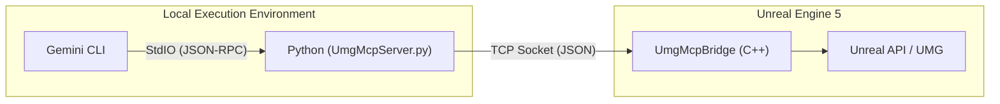

[English version please click here](Readme.md)

# UE5-UMG-MCP 🤖📄

**版本受控的 AI 辅助 UMG 工作流**

[](https://agentseal.org/mcp/https-githubcom-winyunq-unrealmotiongraphics<details<details>
<summary>🎬 点击查看 UMG MCP 能做什么</summary>

- [Demo 设计 RTS UI](https://youtu.be/O86VCzxyF5o)
- [Demo 在 UMG 窗口中复现 UE5 编辑器预览](https://youtu.be/h_J70I0m4Ls)
- [Demo 在 UMG 编辑器中操作 UMG 控件](https://youtu.be/pq12x2MH1L4)
- [与 Gemini 3 对话编辑 UMG 文件](https://youtu.be/93_Fiil9nd8)

</details>

---

<details>
<summary>🛍️ <a href="https://www.fab.com/zh-cn/listings/f70dbcb0-11e4-46bf-b3f7-9f30ba2c9b71">需要更便捷的使用体验？→ 点击前往 Fab 商店购买插件</a></summary>

如果您觉得手动配置插件和 MCP 环境过于繁琐，可以尝试我们在 **Fab** 上架的商业化版本：
[**Fab 版 UMG MCP 直达链接**](https://www.fab.com/zh-cn/listings/f70dbcb0-11e4-46bf-b3f7-9f30ba2c9b71)

**Fab 版与开源版的区别：**
- **开箱即用**：Fab 版可以直接通过虚幻引擎后台安装，无需手动克隆和配置 Python 环境。
- **上下文压缩 (Context Compression)**：Fab 版内置了更智能的上下文管理，底层会自动过滤冗余的 MCP 历史信息，为 AI 腾出更多可用的 Token。
- **商业化支持**：Fab 版侧重于生产环境的商业逻辑。如果您在商业项目中遇到困难，我们将提供更优先的技术支持和解决方案。
- **持续同步**：开源版 (GitHub) 依然是我们的协议先行地，所有核心功能的更新都会同步到开源版本中。

---

👉 [查看开发者计划](#开发者计划) — 参与贡献，免费获得 Fab 版授权。

</details>

---

<details>
<summary>🚀 快速开始</summary>

本指南涵盖了安装 `UmgMcp` 插件并将其连接到 Gemini CLI 的两个步骤。

*   **前提条件：** Unreal Engine 5.6 或更高版本。

#### 1. 安装插件

1.  **进入项目的 Plugins 文件夹：** `YourProject/Plugins/`（如果不存在则创建）。
2.  **直接克隆仓库**到此目录：

    ```bash
    git clone https://github.com/winyunq/UnrealMotionGraphicsMCP.git UmgMcp
    ```

3.  **重启 Unreal Editor。** 这允许引擎检测并编译新插件。

#### 2. 连接 Gemini CLI

告诉 Gemini 如何找到并启动 MCP 服务器。

1.  **编辑您的 `settings.json`** 文件（通常位于 `C:\Users\用户名\.gemini\`）。
2.  **将工具定义添加**到 `mcpServers` 对象中。

    ```json
    "mcpServers": {
      "UmgMcp": {
        "command": "uv",
        "args": [
          "run",
          "--directory",
          "D:\\Path\\To\\YourUnrealProject\\Plugins\\UmgMcp\\Resources\\Python",
          "UmgMcpServer.py"
        ]
      }
    }
    ```

    **注意：** 您**必须**将路径替换为您机器上克隆仓库中 `Resources/Python` 文件夹的正确**绝对路径**。

就是这样！当您启动 Gemini CLI 时，它将自动在后台启动 MCP 服务器。

#### 测试连接

重启 Gemini CLI 并打开 Unreal 项目后，您可以通过调用任何工具函数来测试连接：

```python
  cd Resources/Python/APITest
  python UE5_Editor_Imitation.py
```

#### Python 环境（可选）

插件的 Python 环境由 `uv` 管理。在大多数情况下，它应该会自动工作。如果您遇到与 Python 依赖项相关的问题（例如找不到 `uv` 命令或模块导入错误），您可以手动设置环境：

1.  导航到目录：`cd YourUnrealProject/Plugins/UmgMcp/Resources/Python`
2.  运行设置：
    ```bash
    uv venv
    .\.venv\Scripts\activate
    uv pip install -e .
    ```

</details>

---

<details>
<summary>🧪 实验性功能：Gemini CLI Skill 支持</summary>

我们正在尝试使用 **Gemini CLI Skill** 系统作为标准 MCP 方法的替代方案。
Skill 架构允许 Python 工具直接由 CLI 运行时加载，通过 `prompts.json` 动态启用/禁用工具，潜在地**优化上下文使用**，并避免管理独立 MCP 服务器进程的开销。

> **注意**：上面配置的 MCP 服务器仍然是使用此插件的稳定且推荐的方式。如果您想测试最新的集成能力，请使用 Skill 模式。

#### 配置 (Skill 模式)

要启用 Skill 模式，请将以下内容添加到您的 `settings.json` 中（替换 `<YOUR_PROJECT_PATH>`）：

```json
  "skills": {
    "unreal_umg": {
      "path": "<YOUR_PROJECT_PATH>/Plugins/UmgMcp/Resources/Python/UmgMcpSkills.py",
      "type": "local",
      "description": "通过 Python Skills 直接控制 Unreal Engine UMG。从 prompts.json 自动加载工具。"
    }
  },
```

</details>

---

本项目为管理 Unreal Engine 的 UMG UI 资产提供了一个强大的、命令行驱动的工作流。通过将 **人类可读的 `.json` 文件视为唯一的真理源 (Source of Truth)**，它从根本上解决了在 Git 中对二进制 `.uasset` 文件进行版本控制的挑战。

受 `blender-mcp` 等工具的启发，该系统允许开发人员、UI 设计师和 AI 助手以编程方式与 UMG 资产进行交互，从而实现真正的 Git 协作、自动化 UI 生成和迭代。

---

<details>
<summary>📋 Prompt 管理器</summary>

一个用于配置系统指令、工具描述和用户提示模板的可视化 Web 工具。

### 功能

1.  **系统指令编辑器**：修改针对 AI 上下文的全局指令。
2.  **工具管理**：
    *   **启用/禁用**：开启或关闭特定的 MCP 工具。禁用的工具不会在 MCP 服务器上注册，从而有效地**压缩上下文窗口**，防止 AI 分心。
    *   **编辑描述**：自定义工具描述（提示词），使其更符合您的工作流。
3.  **用户模板 (Prompts)**：添加可重用的提示词模板，方便 MCP 客户端快速访问。

### 如何运行

在您的 Python 环境中执行以下命令：
```bash
python Resources/Python/PromptManager/server.py
```
浏览器将自动打开 `http://localhost:8085`。

### 使用提示

Prompt 对 AI 工具的有效性至关重要。使用 Prompt 管理器来为 AI 量身定制其行为：

*   **一键部署模式**：如果您希望 AI 仅专注于根据设计生成 UI，请禁用除 `apply_layout` 和 `export_umg_to_json` 之外的所有工具。
*   **导师模式**：如果您希望 AI 只是进行指导而不做逻辑更改，请仅保留只读工具（例如 `get_widget_tree`, `get_widget_schema`）。
*   **上下文优化**：对于上下文窗口较小的模型，禁用当前不使用的工具以提高速度和准确性。

欢迎贡献有效的 Prompt 配置！

</details>

---

<details>
<summary>🏗️ 当前技术架构</summary>

系统目前主要依靠 `UE5_UMG_MCP` 插件在外部客户端（如本 CLI）与 Unreal Engine 编辑器之间进行通信。

**架构图：**


```mermaid
flowchart LR
    subgraph "Local Execution Environment"
        CLI["Gemini CLI"] --"StdIO (JSON-RPC)"--> PY["Python (UmgMcpServer.py)"]
    end

    subgraph "Unreal Engine 5"
        PY --"TCP Socket (JSON)"--> TCP["UmgMcpBridge (C++)"]
        TCP --> API["Unreal API / UMG"]
    end
```

</details>

---

<details>
<summary>⚖️ AI 署名与免责声明</summary>

本项目是在 **Gemini (一种 AI)** 的显著协助下开发的。因此：
*   **实验性质**：这是一个实验性项目，不保证其可靠性。
*   **商业用途**：在没有经过彻底的独立验证和了解其局限性的情况下，不建议用于商业用途。
*   **免责声明**：使用风险自负。开发人员和 AI 对因使用本项目而产生的任何后果概不负责。

</details>

---

## UMG Widget API Status

| 分类               | API 名称                         | 状态  | 描述                                                                                            |
| ------------------ | -------------------------------- | :---: | ----------------------------------------------------------------------------------------------- |
| **上下文与注意力** | `get_target_umg_asset`           |   ✅   | 获取当前活跃的 UMG 资产路径。                                                                   |
|                    | `set_target_umg_asset`           |   ✅   | 设置或创建 UMG 资产。                                                                           |
|                    | `get_last_edited_umg_asset`      |   ✅   | 获取上次编辑的 UMG 资产路径。                                                                   |
|                    | `get_recently_edited_umg_assets` |   ✅   | 获取最近编辑的 UMG 资产列表。                                                                   |
| **感知与查询**     | `get_widget_tree`                |   ✅   | 获取widget target下的子节点，以tree形式展示(非常节约Token)                                      |
|                    | `query_widget_properties`        |   ✅   | 查询单个控件的具体属性。                                                                        |
|                    | `get_creatable_widget_types`     |   ✅   | 获取所有可创建的控件类名列表。                                                                  |
|                    | `get_widget_schema`              |   ✅   | 获取指定控件类的属性 Schema。                                                                   |
|                    | `get_layout_data`                |   ✅   | 获取所有控件在视口中的布局包围盒坐标。                                                          |
|                    | `check_widget_overlap`           |   ✅   | 校验当前资产中的控件是否存在空间重叠。                                                          |
| **动作与修改**     | `create_widget`                  |   ✅   | 创建新的控件。                                                                                  |
|                    | `delete_widget`                  |   ✅   | 删除指定的控件。                                                                                |
|                    | `set_widget_properties`          |   ✅   | 设置控件属性（widget_name 缺省时默认修改当前 target；采用并集覆盖写入）。                        |
|                    | `reparent_widget`                |   ✅   | 重新指定控件的父级。                                                                            |
|                    | `save_asset`                     |   ✅   | 保存当前活跃的 UMG 资产。                                                                       |
| **文件转换**       | `export_umg_to_json`             |   ✅   | 将 UMG 资产反编译导出为 JSON 格式。                                                             |
|                    | `apply_json_to_umg`              |   ✅   | 将 JSON 布局定义应用到 UMG 资产中。                                                             |
|                    | `apply_layout`                   |   ✅   | 应用整盘的 HTML/JSON 布局代码。                                                                 |


## UMG 蓝图 (Blueprint) API 实现状态（过渡期）

Blueprint MCP 目前仍是节点级协议。它可用于简单事件连线，但还不是 [Document/BlueprintBluecodeProtocol.md](Document/BlueprintBluecodeProtocol.md) 中描述的高密度 `bluecode` 协议。

| 分类               | API 名称                  | 状态  | 描述                                                                       |
| ------------------ | ------------------------- | :---: | -------------------------------------------------------------------------- |
| **上下文与注意力** | `set_edit_function`       |   ✅   | 设置当前编辑上下文（函数/事件）。支持自动创建自定义事件。                  |
|                    | `set_cursor_node`         | 部分  | 低层级光标逃生口，用于分支或修复流程。优先使用 `set_edit_function` + 追加。 |
| **感知与查询**     | `get_function_nodes`      | 部分  | 过渡期节点读回：只返回 ID、节点名/类名和是否执行节点。                     |
|                    | `get_variables`           |   ✅   | 获取成员变量列表。                                                         |
|                    | `search_function_library` |   ✅   | 搜索可调用的库 (C++/BP)。支持模糊搜索。                                    |
| **并集写入**       | `add_step(name)`          |   ✅   | 根据名称添加可执行节点。支持自动连线与布局。                               |
|                    | `prepare_value(name)`     |   ✅   | 添加数据节点（例如 GetVariable）。                                         |
|                    | `connect_data_to_pin`     |   ✅   | 精确连接引脚（支持 `NodeID:PinName` 格式）。                               |
|                    | `add_variable`            |   ✅   | 添加或更新成员变量；不会删除未提及变量。                                   |
|                    | `compile_blueprint`       |   ✅   | 编译并应用更改。                                                           |
| **隐藏兼容命令**   | `delete_variable`         | 隐藏  | 仅后端兼容；默认 MCP 隐藏，直到删除改为必须 `confirm_delete=true`。         |
|                    | `delete_node`             | 隐藏  | 仅后端兼容；默认 MCP 隐藏，直到删除改为必须 `confirm_delete=true`。         |

说明：
- 当前蓝图读操作还不具备足够高的信息密度，不能视作“读任意信息”的最终协议。
- `bluecode` 应提供代码式读写、只追加/覆盖的合并语义、显式 `bluecode_delete(confirm_delete=true)` 和紧凑编译诊断。
- 在此之前，Blueprint MCP 只建议用于窄范围事件连线，并用 `compile_blueprint` 和聚焦读回验证。

## UMG 动画 (Sequencer) API 实现状态

| 命令                             |   状态   | 描述                                                                                        |
| :------------------------------- | :------: | :------------------------------------------------------------------------------------------ |
| `set_animation_scope`            | ✅ 已实现 | 动画 Target：聚焦当前动画，若不存在会自动创建。                                             |
| `set_widget_scope`               | ✅ 已实现 | 当前动画内的控件 Target。                                                                   |
| `get_all_animations`             | ✅ 已实现 | 返回当前 UMG Target 下的动画简表。                                                          |
| `animation_overview`             | ✅ 已实现 | 返回关键帧数量、轨道数量、关键时间点、变更的属性列表。                                      |
| `animation_widget_properties`    | ✅ 已实现 | 按控件视角查看属性时间线（忽略未被动画驱动的属性）。                                        |
| `animation_time_properties`      | ✅ 已实现 | 按时间切片查看属性值，支持一次查询多个时间点。                                              |
| `animation_append_widget_tracks` | ✅ 已实现 | 按控件+属性批量追加/覆盖关键帧（仅并集/覆盖，不做删除）。                                   |
| `animation_append_time_slice`    | ✅ 已实现 | 在指定时间为多个控件追加差分式属性值。                                                      |
| `animation_delete_widget_keys`   | ✅ 已实现 | 仅删除指定控件+属性在指定时间的关键帧（需 `confirm_delete=true`，符合 Issue 15 安全策略）。 |
| `create_animation`               | ✅ 已实现 | 创建或聚焦动画，支持自动命名。                                                              |
| `delete_animation`               | ✅ 已实现 | 显式删除整段动画，必须传入 `confirm_delete=true`。                                          |

说明：
- `set_animation_scope` / `set_widget_scope` 实现协议中的 Target/缺省语义；命名自动纠错（不再出现 "animal" 拼写），动画缺失时自动创建。
- 写入仅做并集/覆盖，不做隐式删除；如需删除，请使用 `animation_delete_widget_keys` 并显式传入 `confirm_delete=true`。
- `get_animation_keyframes`、`get_animation_full_data`、`set_property_keys`、`set_animation_data`、`remove_property_track`、`remove_keys` 等旧的底层读写命令仍保留后端兼容，但不进入默认 MCP 提示面。
- 默认 Sequencer MCP 都会返回有价值的计数/时间线信息，便于 AI 复述与复现。

## UMG 材质 (Material) API 实现状态

| 命令              | 状态  | 描述                                                                                         |
| ----------------- | :---: | -------------------------------------------------------------------------------------------- |
| `hlsl_set_target` |   ✅   | 锁定/创建 HLSL 目标材质。新材质默认 UI；非 UMG 材质可携带类型字段。                          |
| `hlsl_get`        |   ✅   | 读取当前 HLSL 代码、结构化参数和语义输出契约。                                                |
| `hlsl_set`        |   ✅   | 对 HLSL、参数、额外输出做并集式写入：覆盖已有项，追加缺失项。                                 |
| `hlsl_delete`     |   ✅   | 显式删除 HLSL 参数或输出，必须传入 `confirm_delete=true`；名称歧义时再补 `kind`。             |
| `hlsl_compile`    |   ✅   | 编译当前 HLSL 目标并返回精简诊断信息，便于 AI 后处理。                                        |

### HLSL 协议约定（UMG 垂直优化）

- 材质被视作单一 HLSL 程序。
- 后端约定 HLSL 返回 `float4`。
- 输出自动连线改为语义契约：UI/Post Process/Light Function/Unlit 使用 `EmissiveColor`；Lit Surface 使用 `BaseColor`；alpha 只在需要时接到 `Opacity` 或 `OpacityMask`。
- 额外输出使用 UE 5.8 Custom 节点 `AdditionalOutputs`，因此一个 HLSL 块可以同时驱动 `Roughness`、`Metallic`、`Normal`、`WorldPositionOffset` 等材质根输出。
- 输入参数以结构化描述返回（如 `name`、`kind`、`source_handle`），便于 AI 学习与复用。
- `hlsl_set` 只做并集覆盖和追加；删除必须使用 `hlsl_delete(confirm_delete=true)`。
- 低阶 `material_*` 图编辑工具作为兼容层保留，但 Material ToolMode 默认只暴露 HLSL 闭环。

## UMG 样式与主题 (Style & Theming) API 实现状态 (New)

| 类别     | API 名称             | status | 描述                                          |
| -------- | -------------------- | :----: | --------------------------------------------- |
| **样式** | `set_widget_style`   |   ⏳    | 设置特定控件的详细样式（例如 FButtonStyle）。 |
| **主题** | `apply_global_theme` |   ⏳    | 根据主题配置批量应用样式、字体和配色。        |
| **资源** | `style_create_asset` |   ⏳    | 创建独立的 Slate 控件样式资源。               |

---

## 开发者计划

> 我们注意到有很多 Fork，但几乎没有 PR — 欢迎你来改变这一点。

<details>
<summary>❓ 什么是开发者计划，为什么要有开发者计划？</summary>

现在的时代是 AI 的时代，每个人都有能力让 AI 帮忙开发项目。UMG MCP 是真诚地免费提供给大家学习与使用的——事实上这应该包括 Fab 版本。

参与开发者计划，达成对应条件，在你的开发活跃期间，你将可以访问**私有仓库**。

</details>

<details>
<summary>🎁 为什么开发者计划奖励的是 Fab 版授权？</summary>

Fab 版收费的唯一原因是经济规律：如果它是完全免费的，社会平均劳动时长将大幅降低，最终只会迫使我们付出更多来维持同等价值。Fab 版 UMG MCP 理应免费，但真正免费只会让我们付费更多。

因此，奖励 Fab 版授权的意义有两层：一方面你可以免费访问更高级、更稳定的版本；另一方面，你将有权利参与维护真正的生产级项目。

</details>

<details>
<summary>🛠️ 如何参加 UMG MCP 开发者计划？</summary>

这确实存在一定矛盾——UMG MCP 的设计服务对象是非编程人员，而编程人员也许并不那么需要它。无论如何，我们提供以下几种参与路径：

**路径一 — 视频内容创作：**
针对 UMG MCP **Fab 版**制作专项介绍视频，达到一定传播量即可申请。

**路径二 — 功能开发：**
我们的设计理念很简单：*只要你开发的功能被我们接受，你就达成条件*。提交 PR，合并即认可。

**路径三 — 提示词工程：**
编写有助于 AI 更精准理解和调用工具的系统提示词——即使在所有工具全部开启的情况下，AI 仍然能精确找到正确的工具，这才算有效贡献。

**路径四 — 购买 Fab 版：**
购买了 Fab 版，你当然已经有权利访问此项目。

**申请方式：** 将你的 GitHub 信息发送至 **winyunq@qq.com**

</details>
行开发了？
