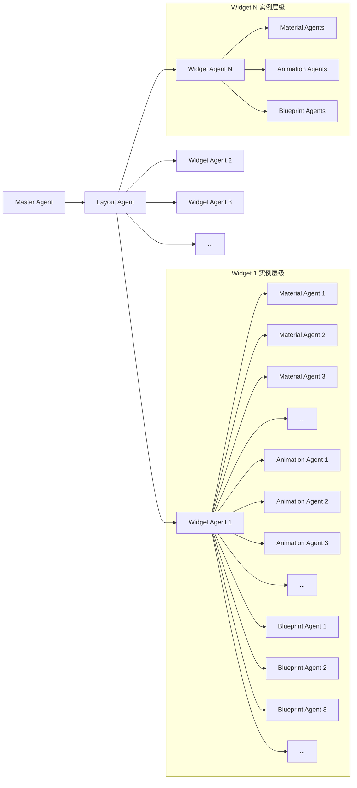
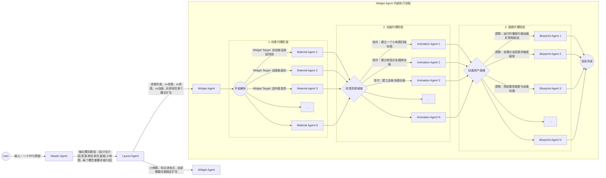

```mermaid
graph LR
    MasterAgent[Master Agent] --> LayoutAgent[Layout Agent]
    
    %% Layout 拉起多个 Widget
    LayoutAgent --> WidgetAgent1[Widget Agent 1]
    LayoutAgent --> WidgetAgent2[Widget Agent 2]
    LayoutAgent --> WidgetAgent3[Widget Agent 3]
    LayoutAgent --> WidgetAgentDots[...]
    LayoutAgent --> WidgetAgentN[Widget Agent N]

    %% Widget 1 的内部层级展示：均展示多个实例
    subgraph Widget1_Group [Widget 1 实例层级]
        direction LR
        WidgetAgent1 --> MA1_1[Material Agent 1]
        WidgetAgent1 --> MA1_2[Material Agent 2]
        WidgetAgent1 --> MA1_3[Material Agent 3]
        WidgetAgent1 --> MA1_Dots[...]
        
        WidgetAgent1 --> AA1_1[Animation Agent 1]
        WidgetAgent1 --> AA1_2[Animation Agent 2]
        WidgetAgent1 --> AA1_3[Animation Agent 3]
        WidgetAgent1 --> AA1_Dots[...]
        
        WidgetAgent1 --> BA1_1[Blueprint Agent 1]
        WidgetAgent1 --> BA1_2[Blueprint Agent 2]
        WidgetAgent1 --> BA1_3[Blueprint Agent 3]
        WidgetAgent1 --> BA1_Dots[...]
    end

    %% Widget N 的内部层级展示：抽象展示
    subgraph WidgetN_Group [Widget N 实例层级]
        direction LR
        WidgetAgentN --> MAN_M[Material Agents]
        WidgetAgentN --> AAN_M[Animation Agents]
        WidgetAgentN --> BAN_M[Blueprint Agents]
    end
```

```mermaid
graph LR
    %% 外部拉起与信息流
    User((User)) -- "输入：'一个RTS界面'" --> Master[Master Agent]
    Master -- "输出概念数组：[设计总介绍,资源,单位命令,面板,小地图...每个概念都要详细介绍]" --> Layout[Layout Agent]
    Layout -- "资源列表，xx资源，xx资源，xx动画...对原本的单个概念扩写" --> WA[Widget Agent]
    Layout -- "小地图，标记进攻点...全部需要详细描述扩写" --> WB[Widget Agent]
    subgraph WidgetInternal [Widget Agent 内部执行流程]
        direction LR
        WA --> Start((开始解析))

        %% 1. 材质阶段
        subgraph MaterialStage [1. 材质代理阶段]
            direction LR
            Start -- "Widget Target: 自动施法按钮特效" --> MA1[Material Agent 1]
            Start -- "Widget Target: 进度条底纹" --> MA2[Material Agent 2]
            Start -- "Widget Target: 选中框高亮" --> MA3[Material Agent 3]
            Start --> MADots[...]
            Start --> MAN[Material Agent N]
        end

        %% 顺序触发
        MA1 & MA2 & MA3 & MAN --> AnimationTrigger{材质资源就绪}
        
        %% 2. 动画阶段
        subgraph AnimationStage [2. 动画代理阶段]
            direction LR
            AnimationTrigger -- "指令：建立一个小地图扫描动画" --> AA1[Animation Agent 1]
            AnimationTrigger -- "指令：建立按钮点击缩放动画" --> AA2[Animation Agent 2]
            AnimationTrigger -- "指令：建立血条消退动画" --> AA3[Animation Agent 3]
            AnimationTrigger --> AADots[...]
            AnimationTrigger --> AAN[Animation Agent N]
        end

        %% 顺序触发
        AA1 & AA2 & AA3 & AAN --> BlueprintTrigger{动画资产就绪}
        
        %% 3. 蓝图阶段
        subgraph BlueprintStage [3. 蓝图代理阶段]
            direction LR
            BlueprintTrigger -- "逻辑：运行时播放扫描动画并禁用按钮" --> BA1[Blueprint Agent 1]
            BlueprintTrigger -- "逻辑：处理点击回调并触发缩放" --> BA2[Blueprint Agent 2]
            BlueprintTrigger -- "逻辑：绑定属性更新与血条动画" --> BA3[Blueprint Agent 3]
            BlueprintTrigger --> BADots[...]
            BlueprintTrigger --> BAN[Blueprint Agent N]
        end

        BA1 & BA2 & BA3 & BAN --> Done((渲染完成))
    end

```